---
## Front matter
title: "Отчёт по лабораторной работе №4"
subtitle: "Операционные системы"
author: "Лисенков Егор Романович"

## Generic otions
lang: ru-RU
toc-title: "Содержание"

## Bibliography
bibliography: bib/cite.bib
csl: pandoc/csl/gost-r-7-0-5-2008-numeric.csl

## Pdf output format
toc: true # Table of contents
toc-depth: 2
lof: true # List of figures
lot: true # List of tables
fontsize: 12pt
linestretch: 1.5
papersize: a4
documentclass: scrreprt
## I18n polyglossia
polyglossia-lang:
  name: russian
  options:
	- spelling=modern
	- babelshorthands=true
polyglossia-otherlangs:
  name: english
## I18n babel
babel-lang: russian
babel-otherlangs: english
## Fonts
mainfont: PT Serif
romanfont: PT Serif
sansfont: PT Sans
monofont: PT Mono
mainfontoptions: Ligatures=TeX
romanfontoptions: Ligatures=TeX
sansfontoptions: Ligatures=TeX,Scale=MatchLowercase
monofontoptions: Scale=MatchLowercase,Scale=0.9
## Biblatex
biblatex: true
biblio-style: "gost-numeric"
biblatexoptions:
  - parentracker=true
  - backend=biber
  - hyperref=auto
  - language=auto
  - autolang=other*
  - citestyle=gost-numeric
## Pandoc-crossref LaTeX customization
figureTitle: "Рис."
tableTitle: "Таблица"
listingTitle: "Листинг"
lofTitle: "Список иллюстраций"
lotTitle: "Список таблиц"
lolTitle: "Листинги"
## Misc options
indent: true
header-includes:
  - \usepackage{indentfirst}
  - \usepackage{float} # keep figures where there are in the text
  - \floatplacement{figure}{H} # keep figures where there are in the text
---

# Цель работы

Освоить основы операционной системы Linux и приобрести навыки, необходимые для эффективной работы с ней.

# Начало работы 

## 1 раздел

Обозначил, что понимаю суть и название курса.

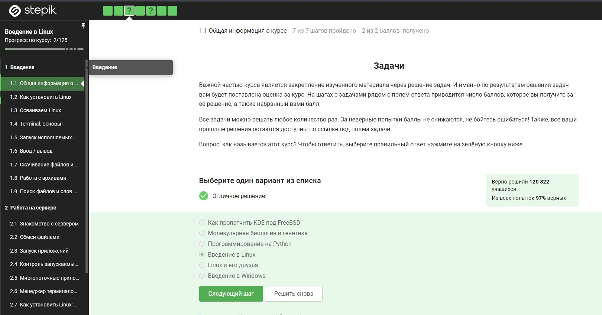{#fig:001 width=70%}

Понял правила курса.

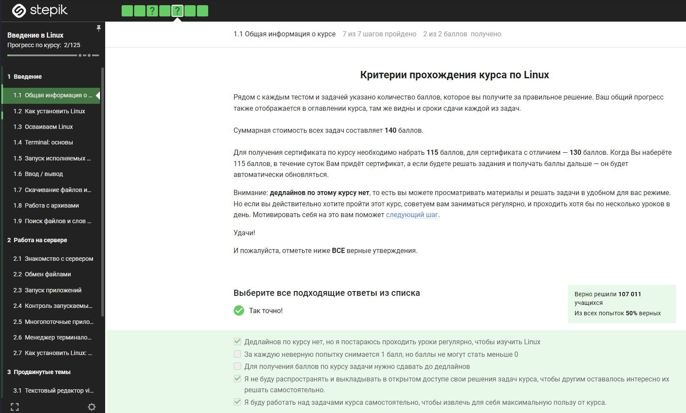{#fig:002 width=70%}

Указал свой выбор.

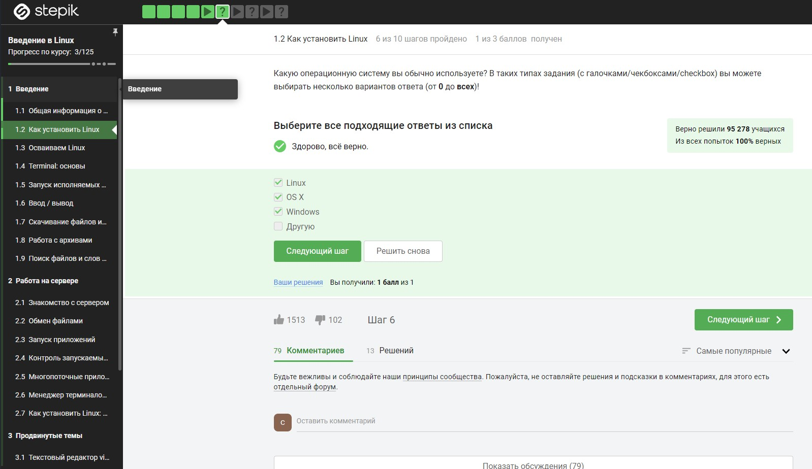{#fig:003 width=70%}

Знаю что такое виртуальная машина.

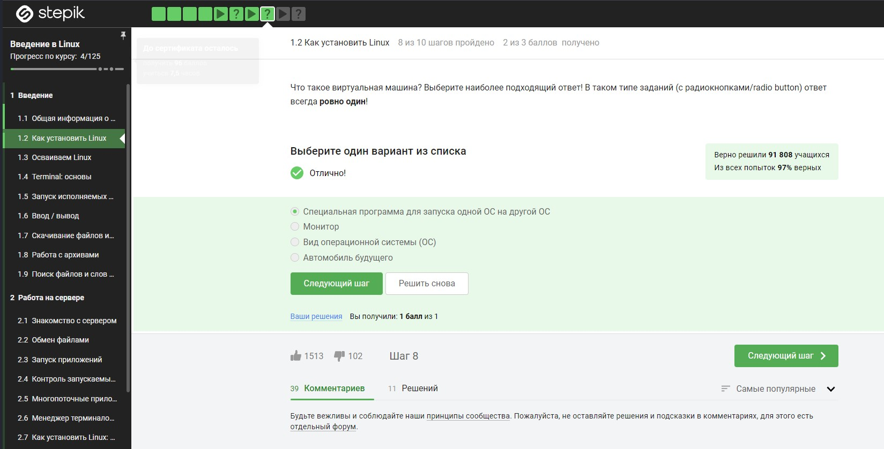{#fig:004 width=70%}

Показал, что я могу запустить Линукс.

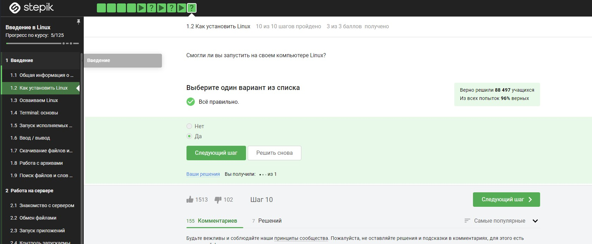{#fig:005 width=70%}

Для выполнения этого задания я создал документ в OpenOffice/LibreOffice Writer и написал в нём строку "Hello, Linux!" с использованием шрифта FreeMono (или Arial или Times New Roman, если FreeMono не был доступен). Затем я сохранил этот документ в формате XML (Microsoft Word 2003 XML) или в формате FODT (OpenDocument Text: Flat XML), как указано в задании. Это позволяет сохранить структуру документа в виде XML-кода или XML-подобного формата, что обеспечивает совместимость с другими программами и облегчает обмен файлами.

Это задание позволило мне ознакомиться с основными функциями текстового редактора OpenOffice/LibreOffice Writer, а также познакомиться с процессом сохранения документов в различных форматах, в том числе в форматах XML и FODT. Теперь я готов к дальнейшему изучению Linux и использованию его в своих проектах и задачах.

{#fig:006 width=70%}

Установочные пакеты в Linux, особенно в дистрибутиве Ubuntu, обычно имеют расширение ".deb". Это формат пакетов, который используется в Debian и его производных дистрибутивах, включая Ubuntu. Такие пакеты содержат программное обеспечение, а также информацию о зависимостях и инструкции по установке, что делает процесс установки и управления программами на Ubuntu более удобным и эффективным.

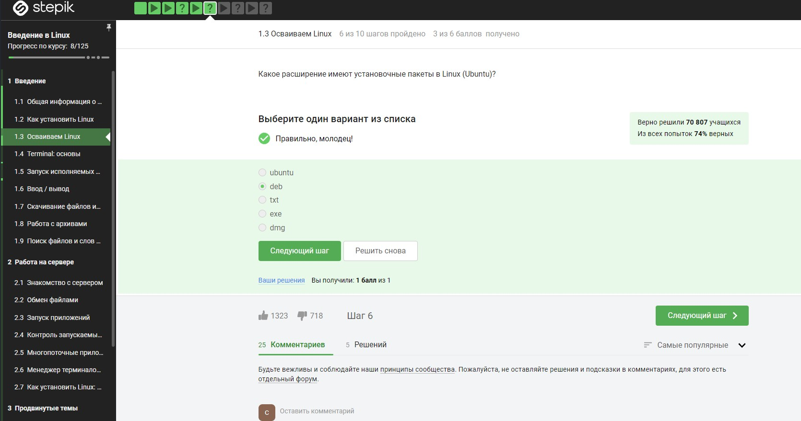{#fig:007 width=70%}

Вкладка "About" (О программе) в плеере VLC содержит информацию о разработчиках программы. В данном случае, первая фамилия, указанная в списке авторов, - Aimar.

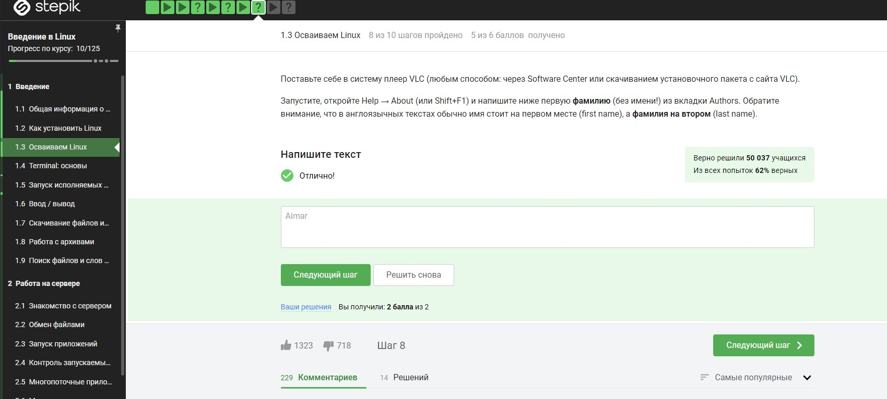{#fig:008 width=70%}

1. Для обновления ссылок в Software Center - НЕТ. Update Manager не предназначен для обновления ссылок в Software Center. Его основная задача - управление обновлениями операционной системы и установленного программного обеспечения.

2. Для установки новых программ - НЕТ. Update Manager не используется для установки новых программ. Его функциональность ограничивается управлением обновлениями.

3. Для обновления установленных программ - ДА. Основная цель Update Manager - обновление уже установленных программ и компонентов операционной системы, обеспечивая пользователям последние версии и исправления для программ и пакетов, установленных на их компьютерах.

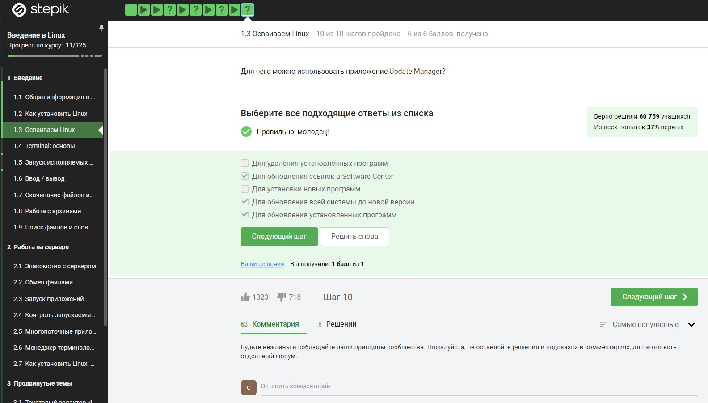{#fig:009 width=70%}

Ну тут я использовал знания русского языка.

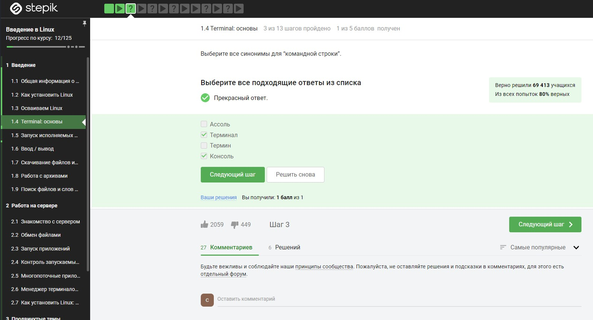{#fig:010 width=70%}

Команда `pwd` используется для вывода текущей рабочей директории в командной строке. Она отображает полный путь к текущей директории, в которой пользователь находится в данный момент. Название команды `pwd` является сокращением от "print working directory" (печать текущей директории). Она показывает, где находится пользователь относительно корневой директории файловой системы.

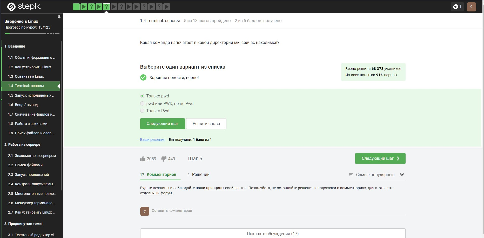{#fig:011 width=70%}

Да, все предложенные команды являются полностью эквивалентными команде `ls -A --human-readable -l /some/directory`. 


1. `ls --almost-all --human-readable -l /some/directory` - `--almost-all` является альтернативным именем для `-A`, и они выполняют одну и ту же функцию, которая показывает все файлы и папки, включая скрытые, кроме ссылок на текущий и родительский каталоги.
2. `ls --human-readable -A -l /some/directory` - порядок опций не важен, поэтому `-A` и `-l` можно расположить в любом порядке.
3. `ls -lAh /some/directory` - опции могут быть объединены вместе без пробелов между ними, поэтому `-lAh` эквивалентно `-l -A -h`.
4. `ls -h -A -l /some/directory` - аналогично предыдущему, но опции перечислены в другом порядке.
5. `ls -Ahl /some/directory` - опции также можно объединить без пробелов в любом порядке, поэтому `-Ahl` эквивалентно `-A -h -l`.

Все эти команды выполнены с одним и тем же набором опций, что и `ls -A --human-readable -l /some/directory`, и поэтому они полностью эквивалентны.

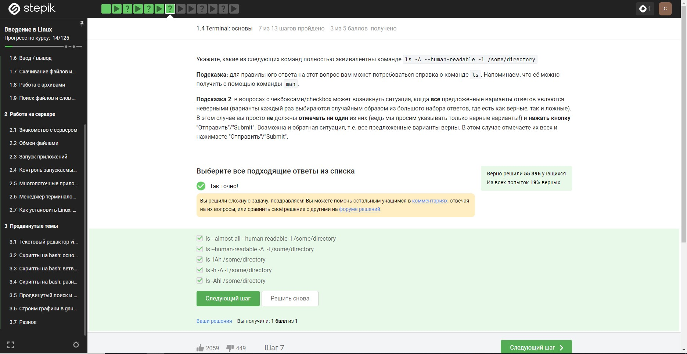{#fig:012 width=70%}

1. `ls ~/Downloads` - Выведет содержимое директории Downloads, которая находится в домашней директории пользователя. Символ `~` обозначает домашнюю директорию текущего пользователя.
2. `ls ../Downloads` - Выведет содержимое директории Downloads, которая находится в родительской директории относительно текущей (то есть в директории /home/bi).
3. `ls /home/bi/Downloads` - Выведет содержимое директории Downloads, используя абсолютный путь к ней.
4. `ls ./../Downloads` - Выведет содержимое директории Downloads, используя относительный путь, указывая на родительскую директорию относительно текущей, а затем переходя в директорию Downloads.

Каждая из этих команд позволяет вывести содержимое директории Downloads, находясь в /home/bi/Documents, при этом не показывая содержимое других директорий.

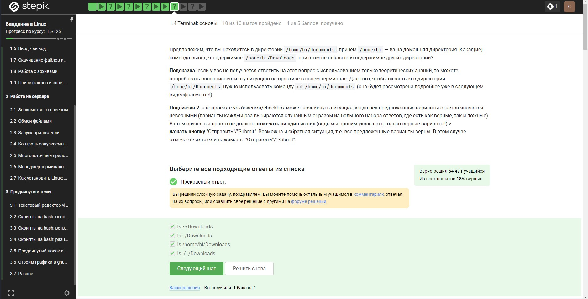{#fig:013 width=70%}

rm - это команда для удаления файлов или директорий.

-r - это опция команды rm, которая указывает на рекурсивное удаление. Это означает, что команда rm будет удалять все файлы и поддиректории в указанной директории, включая саму эту директорию. Именно благодаря этой опции rm способна удалить целые директории и их содержимое.

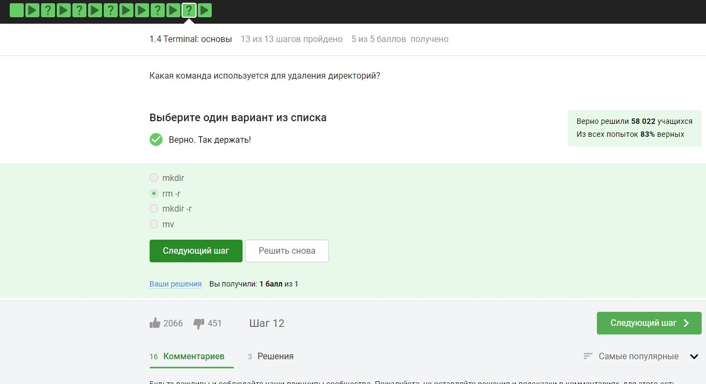{#fig:014 width=70%}

Когда вы вводите команду firefox в терминале, он запускает браузер Mozilla Firefox в новом процессе. Затем, когда вы вводите exit в этом же терминале, это завершает работу текущего терминального сеанса, но не оказывает влияния на процессы, запущенные из этого сеанса, такие как Firefox. Следовательно, закрытие терминала не приведет к закрытию Firefox.

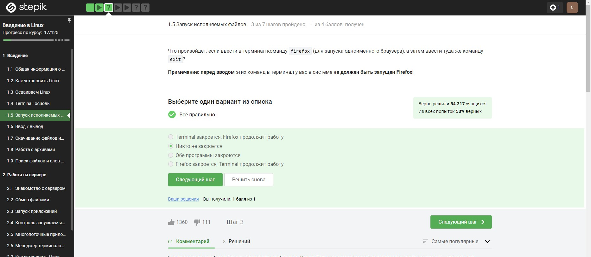{#fig:015 width=70%}

Запуск: После ввода команды с символом &, программа запускается в фоновом режиме, аналогично тому, как если бы она была запущена без блокировки терминала.

Ctrl+Z: Это сочетание клавиш используется для приостановки выполнения текущего процесса в терминале. Если программа была запущена без символа &, то при использовании комбинации клавиш Ctrl+Z выполнение программы приостанавливается. В случае, если программа была запущена с символом &, то процесс можно приостановить, нажав Ctrl+Z.

bg: После приостановки выполнения процесса с помощью Ctrl+Z, команда bg позволяет возобновить выполнение этого процесса в фоновом режиме.

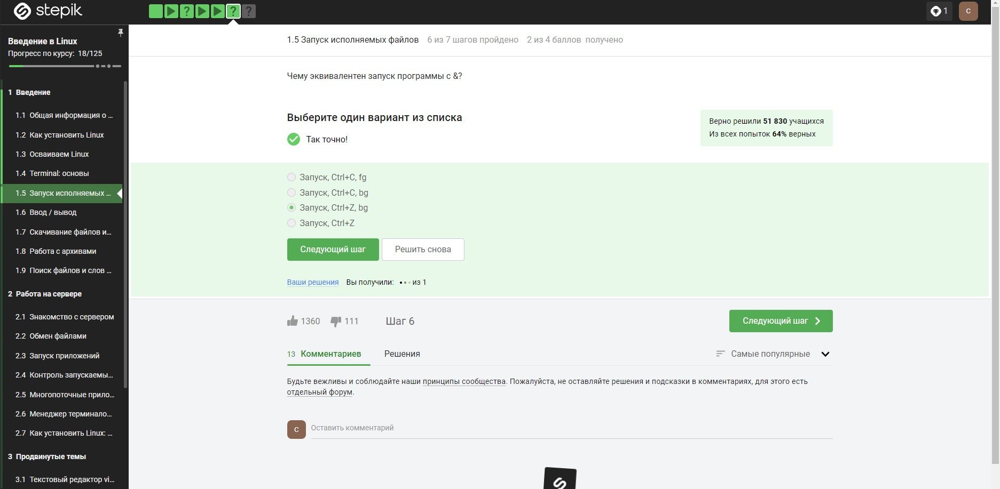{#fig:016 width=70%}

Произвёл запуск и увидел.

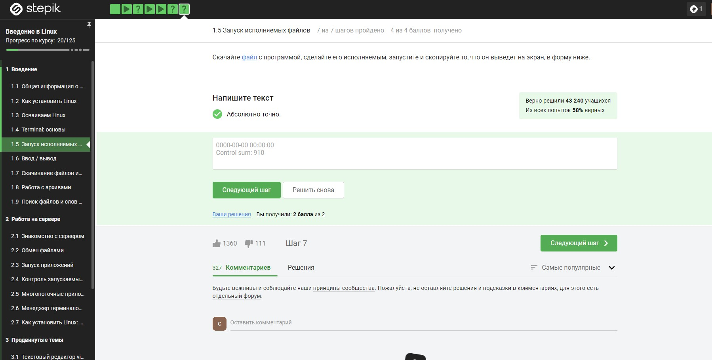{#fig:017 width=70%}

Когда программа запускается в терминале, её стандартный вывод (stdout) и поток ошибок (stderr) по умолчанию направляются на терминал. Это означает, что любые сообщения об ошибках, которые генерирует программа, будут выведены на экран, чтобы пользователь мог видеть их и реагировать соответственно.

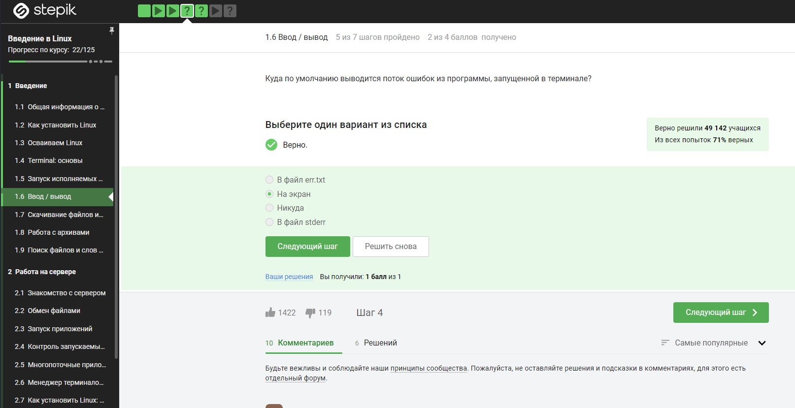{#fig:018 width=70%}

1. `program 2>> file.txt`: Эта команда направляет поток ошибок программы `program` в файл file.txt, причем оператор `>>` используется для добавления вывода в файл, сохраняя при этом уже существующие данные в файле, или создавая новый файл, если он не существует.
2. `program 2> file.txt`: Эта команда также направляет поток ошибок программы `program` в файл file.txt, но оператор `>` перенаправляет вывод, полностью перезаписывая файл, если он уже существует, а не добавляя новые данные к уже существующим. Таким образом, при первом выполнении команды файл file.txt будет создан и заполнен потоком ошибок программы program, но при последующих выполнениях файл будет перезаписываться, а не дополняться.

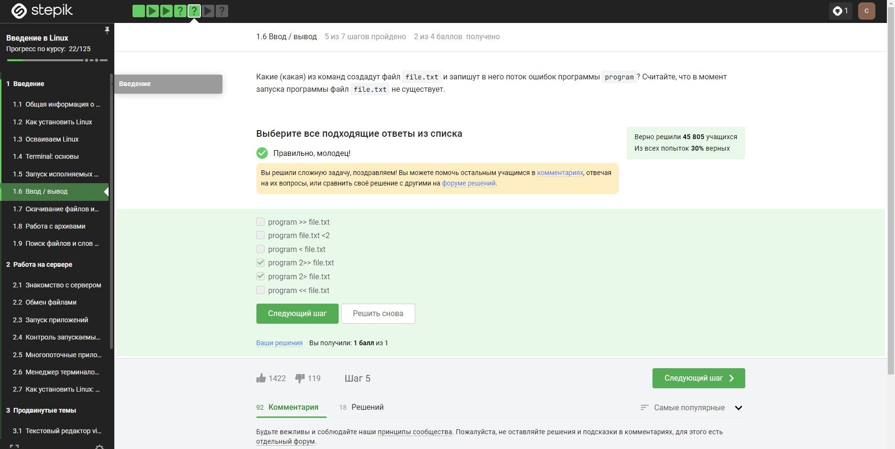{#fig:019 width=70%}

Когда программы объединяются в конвейер, стандартный вывод (stdout) первой программы передается на вход (stdin) второй программе. Однако поток ошибок (stderr) каждой программы остается незатронутым и продолжает направляться на стандартный вывод терминала. Таким образом, если не производится явное перенаправление потока ошибок в конвейер, сообщения об ошибках будут выводиться на экран.

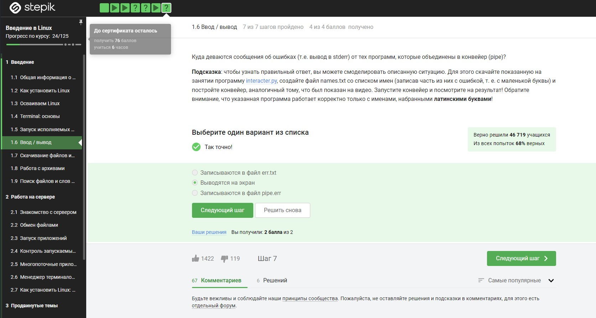{#fig:020 width=70%}

cd /home/alex/: Команда cd переходит в директорию /home/alex/.

wget -P /home/alex/Pictures -O 1.jpg http://example.com/example.jpg: Эта команда скачивает картинку по указанному URL (http://example.com/example.jpg) и сохраняет её в директорию /home/alex/Pictures под именем 
1.jpg. Однако, поскольку в команде указан флаг -O 1.jpg, который задает имя файла, картинка будет сохранена как 1.jpg в указанной директории.

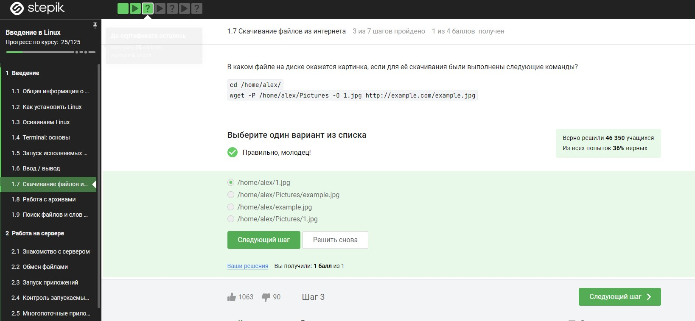{#fig:021 width=70%}

-q или --quiet: Эти опции подавляют вывод сообщений о выполнении команды wget, что означает, что команда будет работать в тихом режиме и не будет выводить никаких лишних сообщений на экран.

{#fig:022 width=70%}

wget -r: Эта опция указывает wget рекурсивно следовать по ссылкам на web-странице для загрузки связанных файлов.

-l 1: Эта опция ограничивает глубину рекурсии до 1, то есть wget будет загружать только файлы, связанные с начальной страницей.

-A jpg: Эта опция указывает wget загружать только файлы с расширением .jpg.

Таким образом, скачаются файлы с расширением .jpg и все HTML-файлы на глубине 1. Однако, поскольку wget был запущен с фильтром -A jpg, все скачанные HTML-файлы будут удалены после завершения загрузки, так как они не соответствуют этому фильтру.

{#fig:023 width=70%}

gzip: Это архиватор, который работает с файлами в формате gzip (.gz). Он используется для сжатия файлов, при этом сохраняя только один файл и не сохраняя структуру директорий. По умолчанию, после распаковки архива gzip, сам архив удаляется.

zip: Это архиватор, который работает с файлами в формате zip (.zip). В отличие от gzip, zip сохраняет не только один файл, но и структуру директорий, что позволяет архивировать и извлекать целые папки с файлами. По умолчанию, архив zip не удаляется после его распаковки, оставляя его на месте.

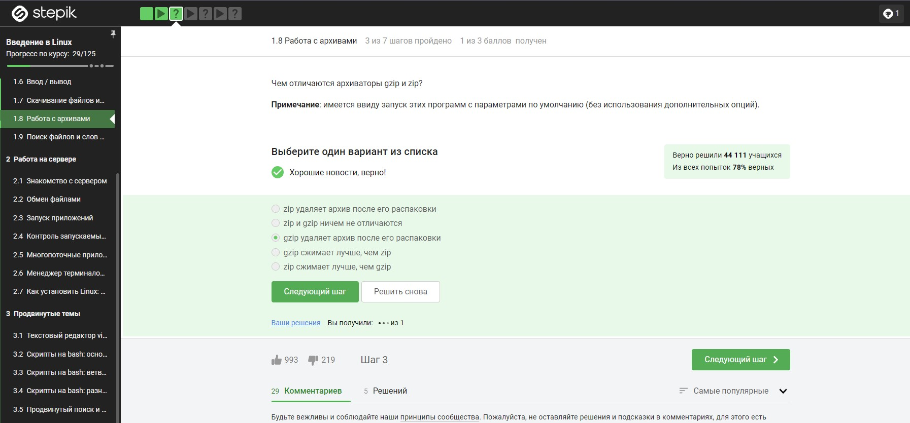{#fig:024 width=70%}

zip: Zip поддерживает архивирование файлов и директорий в формате .zip.

tar: Tar может создавать архивы, включающие в себя файлы и директории, сохраняя при этом их иерархию.

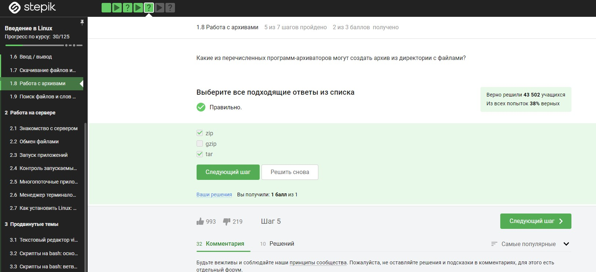{#fig:025 width=70%}

-c: Создание нового архива.

-j: Использование алгоритма сжатия bzip2 для сжатия файлов.

-v: Отображение подробной информации о процессе создания архива.

-f: Указание имени архива.

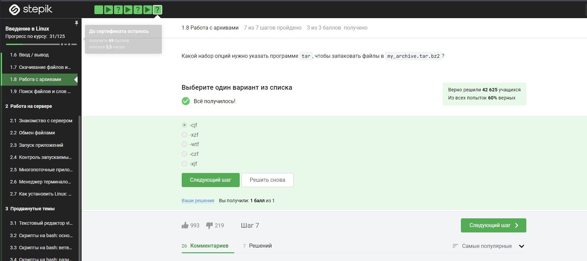{#fig:026 width=70%}

Маска *.jpg ищет все файлы, имя которых оканчивается на .jpg, и не будет включать файлы с именем Alexey.jpeg, так как они не соответствуют данному шаблону.

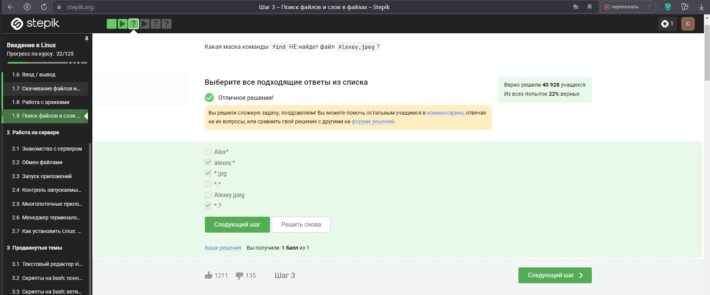{#fig:027 width=70%}

Ищем по-нижнему регистру 

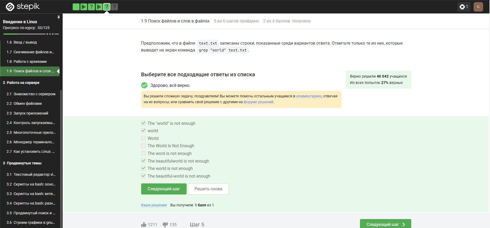{#fig:028 width=70%}

Программа отработала корректно

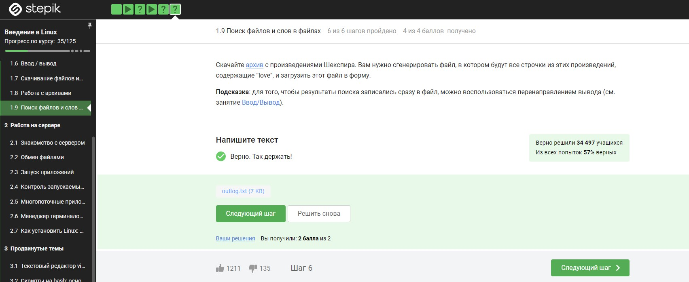{#fig:029 width=70%}

1. Выполнение сложных (затратных по памяти и времени) вычислений: Удаленные серверы с более мощным аппаратным обеспечением и большими вычислительными ресурсами могут использоваться для выполнения сложных вычислений, которые требуют большого объема памяти и времени.

2. Хранение общедоступных данных (например, доступных для всех пользователей интернета): Удаленные серверы могут использоваться для хранения данных, которые должны быть доступны всем пользователям интернета, например, содержимое веб-сайтов, общедоступные файлы и т. д.

3. Хранение больших объемов данных: Удаленные серверы обычно обладают большим объемом хранилища, что позволяет использовать их для хранения больших объемов данных, например, для архивирования, резервного копирования и обработки данных.

4. Хранение конфиденциальных данных (т.е. доступ к ним должны иметь только ограниченный круг лиц): Удаленные серверы могут быть настроены для хранения конфиденциальных данных, к которым должен иметь доступ только ограниченный круг лиц. Это может включать в себя данные о клиентах, финансовые данные и другую чувствительную информацию.

## 2 РАЗДЕЛ

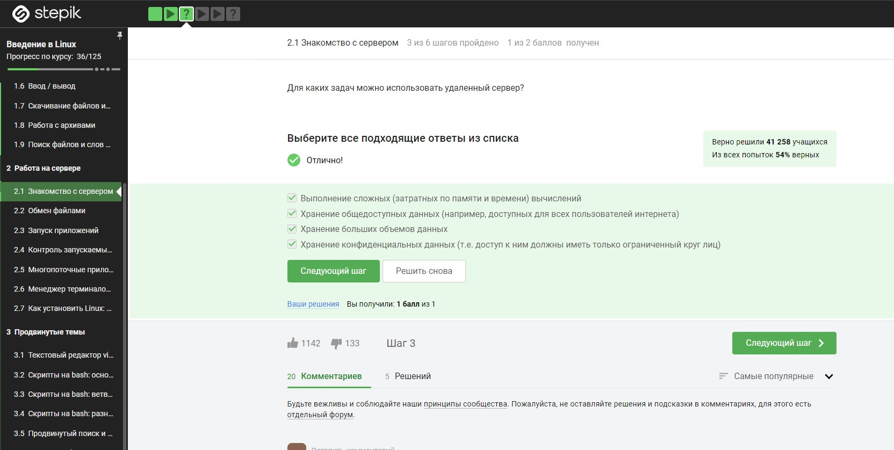{#fig:030 width=70%}

Ключ id_rsa.pub является открытым ключом, который используется для проверки подписи, а не для создания подписи. Это означает, что он не содержит приватной информации и может быть безопасно распространен и использован для аутентификации на удаленных серверах.

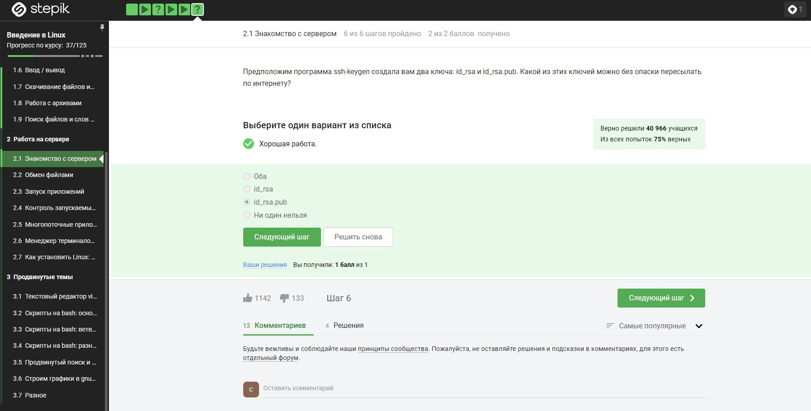{#fig:031 width=70%}

- `scp`: Эта команда используется для копирования файлов между компьютерами по SSH.
- `-r`: Этот флаг указывает `scp` на рекурсивное копирование, что означает, что она будет копировать папку `stepic` вместе с ее содержимым и всеми подпапками.
- `stepic`: Это имя папки, которую нужно скопировать.
- `username@server`: Это имя пользователя и адрес сервера, куда нужно скопировать файлы.
- `~/`: Это указывает на домашнюю директорию пользователя на сервере, куда будут скопированы файлы.

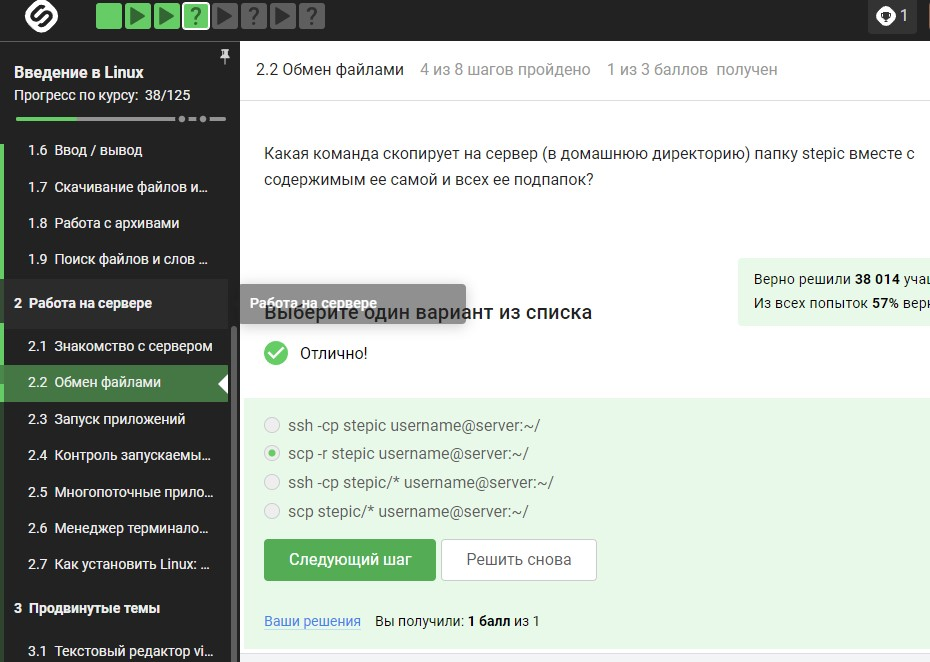{#fig:032 width=70%}

1. **Проверка интернет-соединения и его установка, если соединения нет**: Первым шагом следует убедиться, что компьютер подключен к интернету. Если интернет-соединение отсутствует, необходимо его настроить или восстановить.
   
2. **Обновление списка пакетов**: Команда `sudo apt-get update` обновляет список доступных пакетов из источников APT. Это может помочь в случае, если информация о доступных пакетах устарела или была изменена.

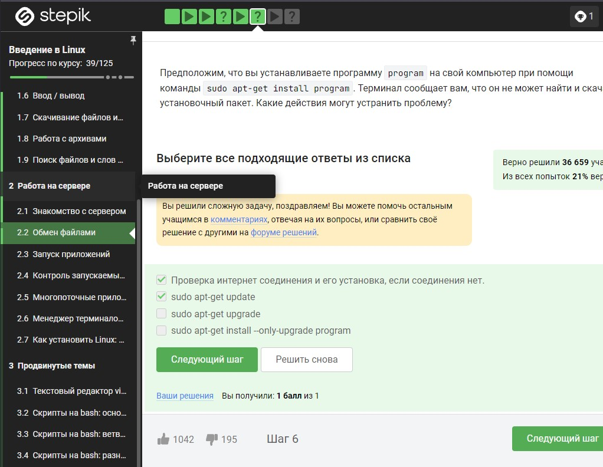{#fig:033 width=70%}

1. **Для копирования файлов со своего компьютера на сервер**: Filezilla предоставляет пользователю возможность загружать файлы с локального компьютера на удаленный сервер.

2. **Для копирования файлов с сервера на свой компьютер**: Также Filezilla позволяет пользователю скачивать файлы с удаленного сервера на локальный компьютер.

Filezilla также обеспечивает возможность просмотра содержимого директорий как на локальном компьютере, так и на удаленном сервере, но основное её назначение - управление файлами и их передача между компьютером пользователя и сервером.

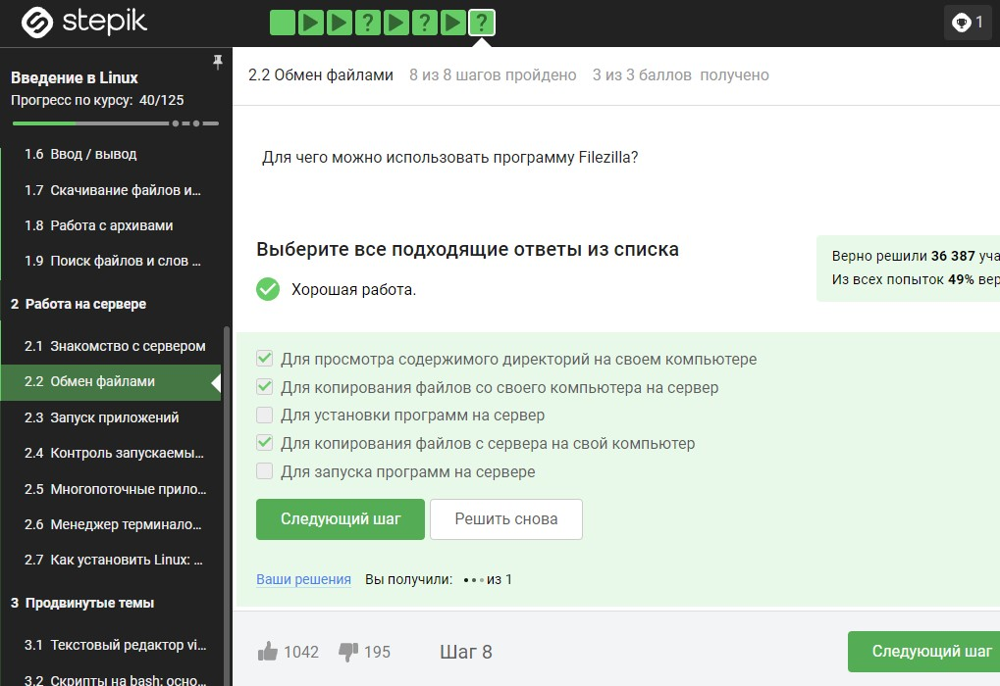{#fig:034 width=70%}

1. **Настроить сервер, чтобы он поддерживал вывод информации на экран компьютера**: Это может быть реализовано различными способами, включая использование удаленного рабочего стола или графического сервера (например, X11), который позволит программе выводить графический интерфейс на удаленном компьютере.

2. **Проверить, есть ли другая версия этой программы (специально для терминала)**: Возможно, для программы существует версия, предназначенная для работы в терминале (CLI), которая может быть запущена на сервере без необходимости графического интерфейса. Если такая версия существует, её можно использовать для выполнения задач на сервере.

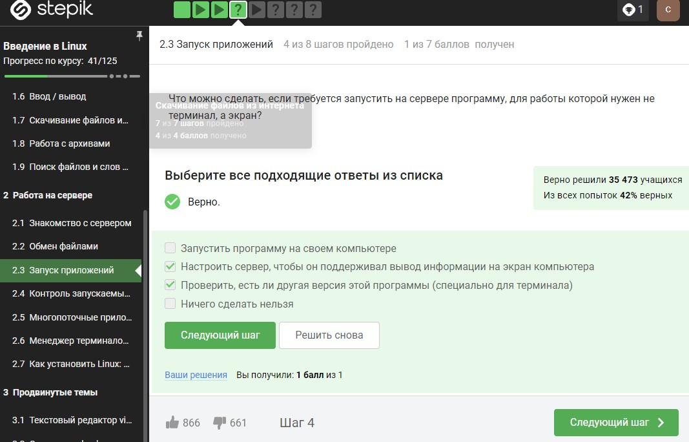{#fig:035 width=70%}

1. **man program**: Команда `man` (от "manual") предназначена для отображения справочной информации о программе в терминале. После выполнения команды `man program` будет отображена справочная страница, содержащая описание программы, её опций и примеры использования.

2. **help program**: Эта команда предназначена для отображения встроенной справочной информации о командах в командной оболочке (например, в bash). Однако, она может быть не доступна для всех программ, а только для команд, встроенных в оболочку.

3. **program --help**: Многие программы поддерживают опцию `--help` для вывода краткой справочной информации о программе и её опциях. В некоторых случаях также могут использоваться варианты опций, такие как `-help`, `-h`, `-H` и т. д.

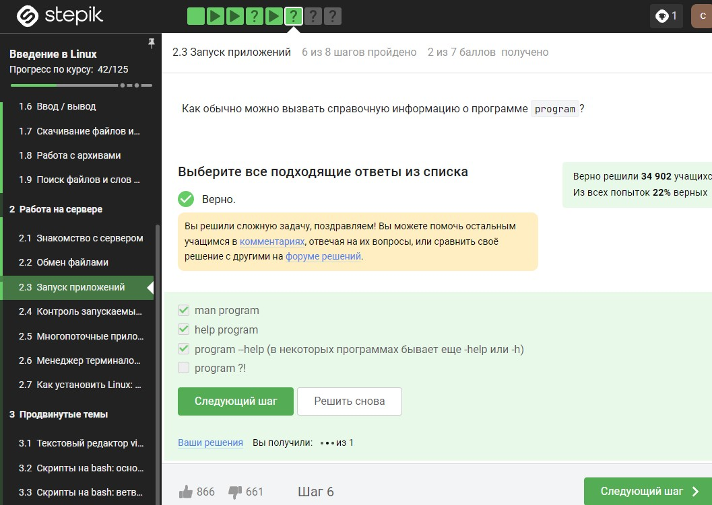{#fig:036 width=70%}

Для определения форматов данных, которые программа FastQC может принимать на вход, следует обратиться к её справке. Для этого выполним команду `./fastqc --help` из каталога, в котором находится исполняемый файл `fastqc`.

По результатам обзора справки, форматы данных, которые программа FastQC может принимать на вход, не указаны напрямую. FastQC предназначен для анализа качества последовательностей, полученных из различных источников, и обычно принимает файлы в форматах FASTQ и BAM. Однако, без доступа к точным данным из справки программы, нельзя дать точный ответ на вопрос о поддерживаемых форматах данных.

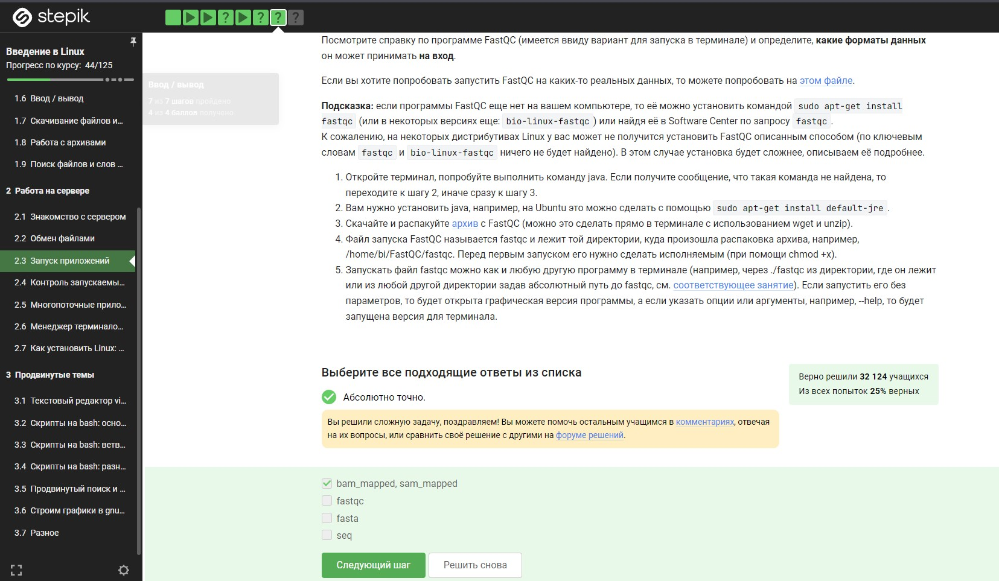{#fig:037 width=70%}

clustalw: имя исполняемого файла Clustal для версии терминала.

test.fasta: имя входного файла с последовательностями для выравнивания.

-align: опция, указывающая Clustal на выполнение множественного выравнивания.

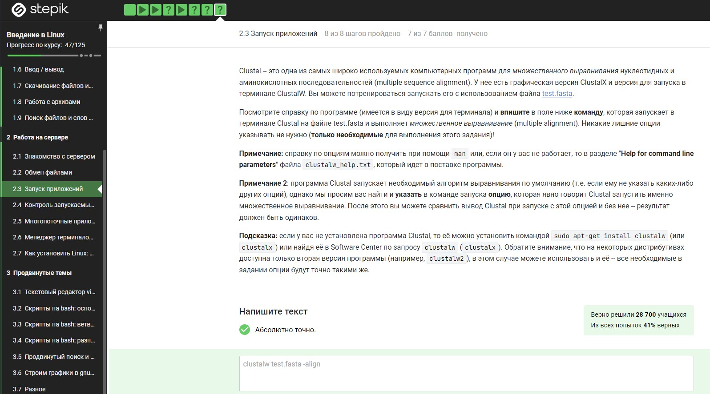{#fig:038 width=70%}

Команда `jobs` отображает список заданий, запущенных в фоновом режиме в текущем сеансе терминала. После выполнения предложенной последовательности команд:

1. `fg %1`: Эта команда возобновляет выполнение задания №1 в переднем плане (foreground), то есть программа program1. Однако, мы немедленно прерываем выполнение этой программы с помощью Ctrl+C.

2. `fg %2`: Затем команда пытается возобновить выполнение задания №2 в переднем плане, то есть program2. После этого выполнения этого задания мы приостанавливаем его с помощью Ctrl+Z.

Таким образом, после выполнения этих команд, информация о программах program1 и program2 будет потеряна, а в списке jobs останется только информация о program3.

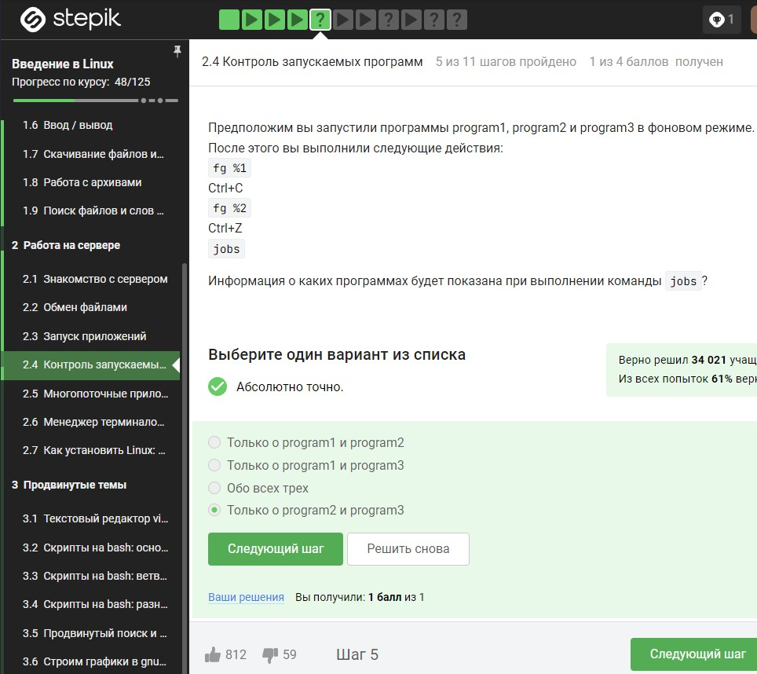{#fig:039 width=70%}

Идентификаторы, которые указываются в утилитах `jobs`, `top` и `ps`, имеют разное назначение и принцип работы:

1. **jobs**: Эта команда отображает список заданий, запущенных в текущем сеансе терминала. Идентификаторы в jobs представляют собой порядковые номера заданий в рамках текущего сеанса терминала. Они могут быть не уникальными и могут изменяться при завершении или приостановке заданий.

2. **top**: Эта утилита отображает список процессов, запущенных в системе. Идентификаторы процессов в top являются уникальными идентификаторами (PID - Process ID), присвоенными операционной системой каждому процессу. Они уникальны в пределах всей системы и не изменяются в течение жизненного цикла процесса.

3. **ps**: Утилита ps также отображает список процессов, запущенных в системе. Идентификаторы процессов в ps также являются уникальными идентификаторами (PID), присвоенными операционной системой каждому процессу. Они уникальны в пределах всей системы и не изменяются в течение жизненного цикла процесса.

Таким образом, идентификаторы в jobs не совпадают с идентификаторами в top и ps, потому что jobs отображает информацию о заданиях в терминале, в то время как top и ps показывают информацию о процессах в системе.

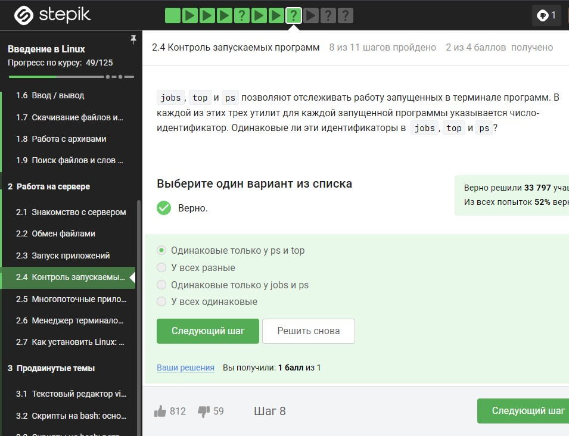{#fig:040 width=70%}

 Команда kill используется для отправки сигналов процессам в UNIX-подобных системах, включая Linux. Сигнал с номером 9, известный как SIGKILL, используется для немедленного завершения процесса. Когда процесс получает сигнал SIGKILL, он не имеет возможности обработать его или выполнить какие-либо дополнительные операции завершения, что приводит к немедленному завершению процесса.

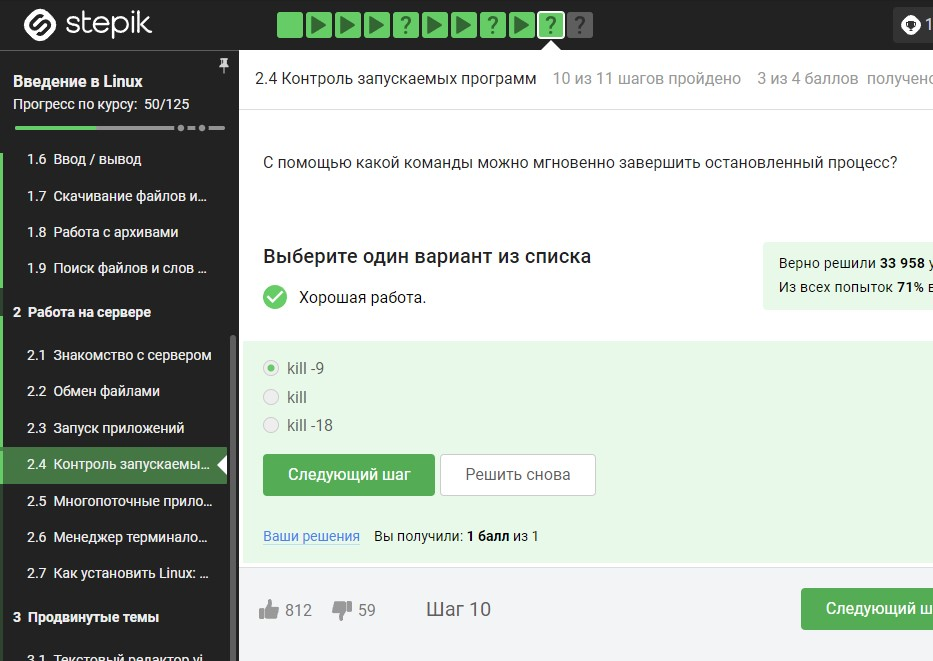{#fig:041 width=70%}

Когда процесс приостанавливается с помощью комбинации клавиш Ctrl+Z, он становится в состояние приостановки (Suspended). Если после этого на него будет применена команда kill без каких-либо опций, то процесс приступит к завершению, как только будет возобновлен, т.е. когда вы введете команду fg или bg, чтобы возобновить выполнение процесса.

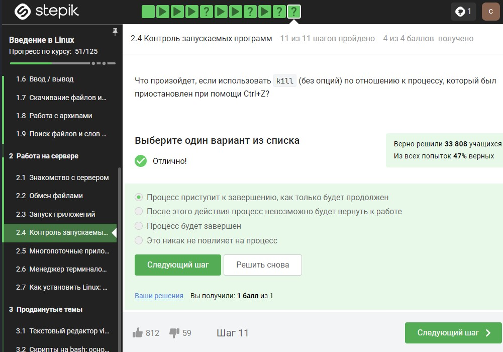{#fig:042 width=70%}

Когда многопоточное приложение приостанавливается посредством Ctrl+Z, все его потоки также останавливаются, что приводит к тому, что они больше не используют процессорное время. Поэтому процент использования CPU для этого приложения будет равен 0%.

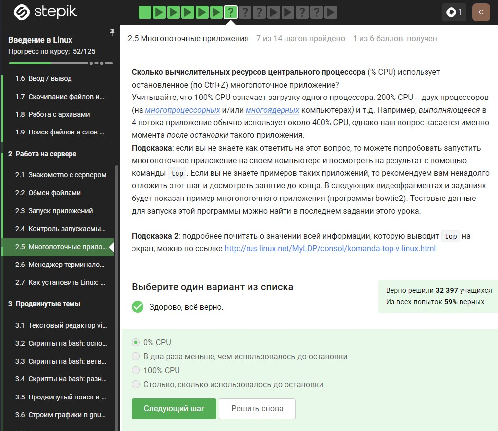{#fig:043 width=70%}

Приложение, остановленное посредством Ctrl+Z, не освобождает память, которую использовало в момент приостановки. Таким образом, количество занимаемой памяти останется таким же, как в момент остановки приложения.

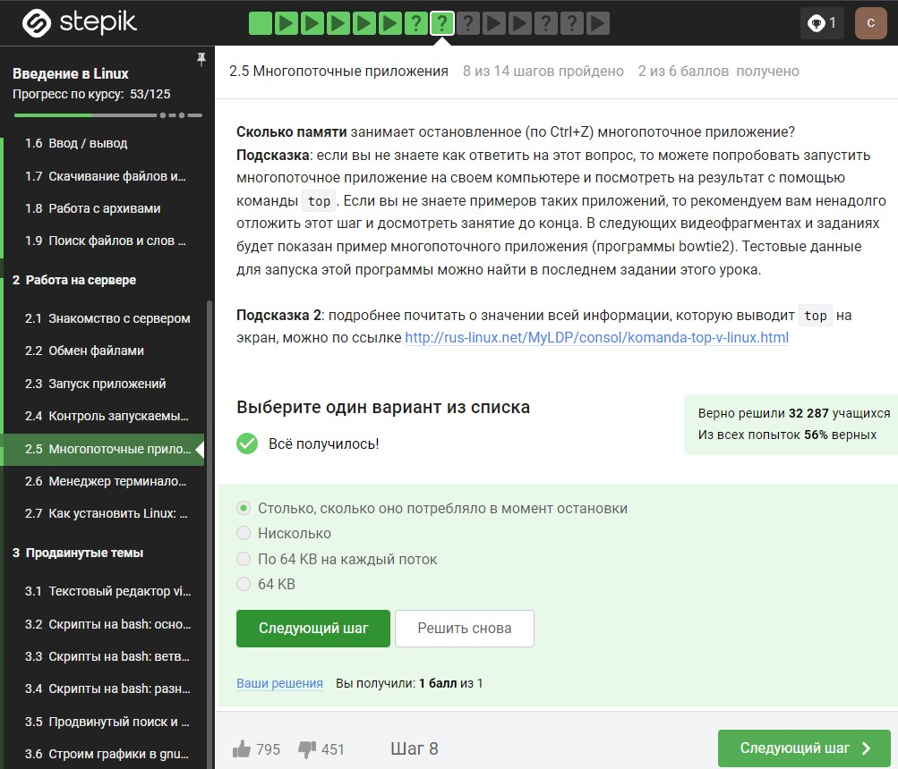{#fig:044 width=70%}

Если многопоточное приложение запущено, то завершить только один из его потоков принудительно довольно сложно. Это связано с тем, что потоки взаимодействуют с общими ресурсами и данными, и завершение одного потока может нарушить работу приложения в целом. Обычно потоки в рамках приложения завершаются вместе с его завершением. Если однако потребуется остановить выполнение приложения, то можно воспользоваться командой `kill` с соответствующим идентификатором процесса.

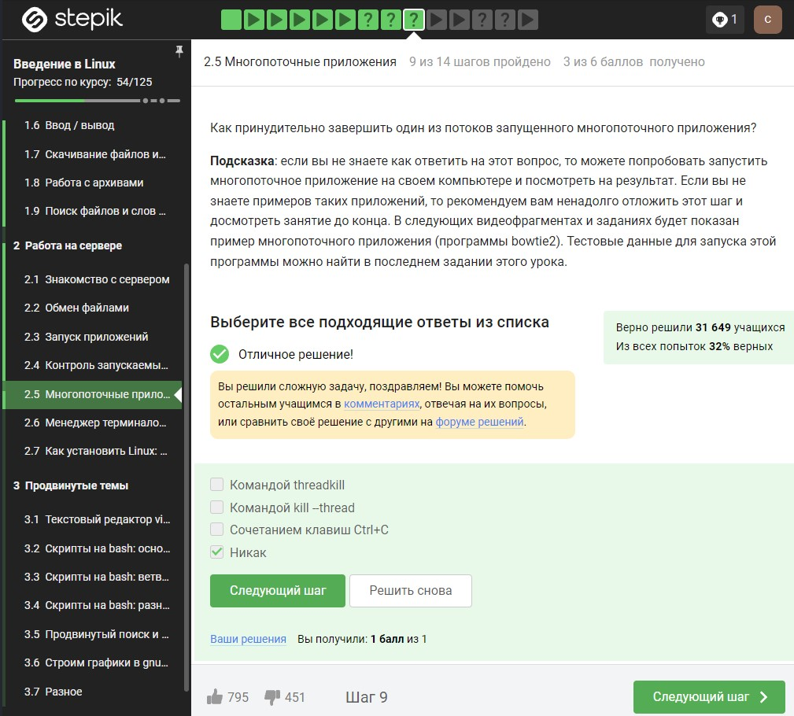{#fig:045 width=70%}

Из двух подпрограмм bowtie2 и bowtie2-build, только bowtie2 позволяет выполняться в несколько потоков одновременно. Программа bowtie2-build, используемая для предварительной индексации референсного генома, обычно выполняется последовательно и не поддерживает многопоточность.

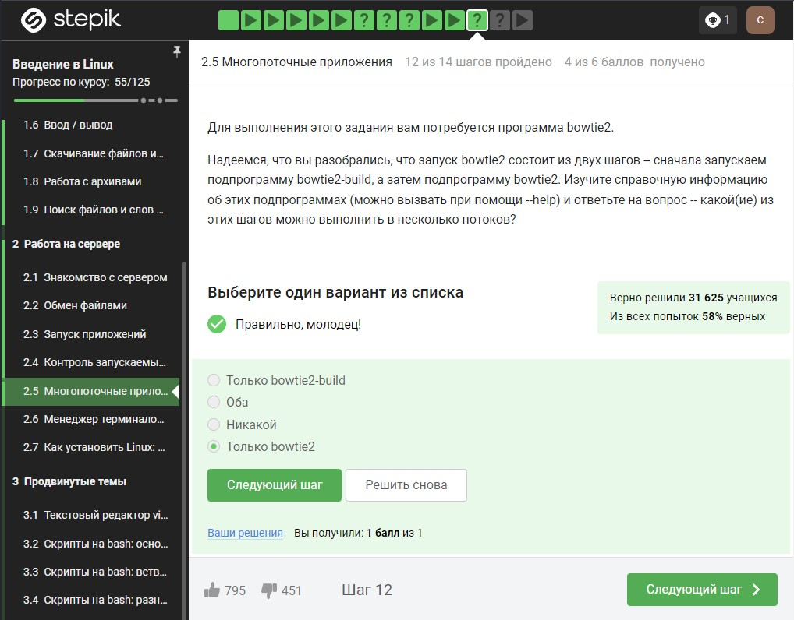{#fig:046 width=70%}

Это сообщение представляет собой результат работы программы bowtie2 и содержит информацию о выравнивании прочтений на референсный геном. Вот что означают эти цифры:

- "306174 reads" - всего обработано 306174 прочтений.
- "306174 (100.00%) were unpaired" - все прочтения были неспаренными.
- "11 (0.00%) aligned 0 times" - 11 прочтений не были выровнены ни на один раз.
- "305580 (99.81%) aligned exactly 1 time" - 305580 прочтений были выровнены ровно один раз.
- "583 (0.19%) aligned >1 times" - 583 прочтения были выровнены более одного раза.
- "100.00% overall alignment rate" - общая степень выравнивания составляет 100%.

Эти данные предоставляют информацию о качестве и количестве выравнивания прочтений на геном.

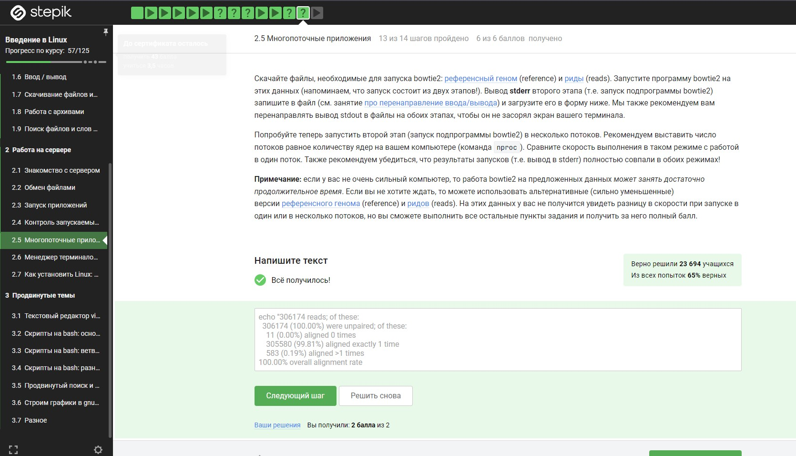{#fig:047 width=70%}

Когда вы запускаете команду fg во второй вкладке терминала, она пытается вернуть в активное состояние процесс, который был приостановлен в первой вкладке. Однако, так как вторая вкладка не имеет доступа к процессам, созданным в первой вкладке, терминал выдаст сообщение об ошибке, указывая на отсутствие процесса для возобновления.

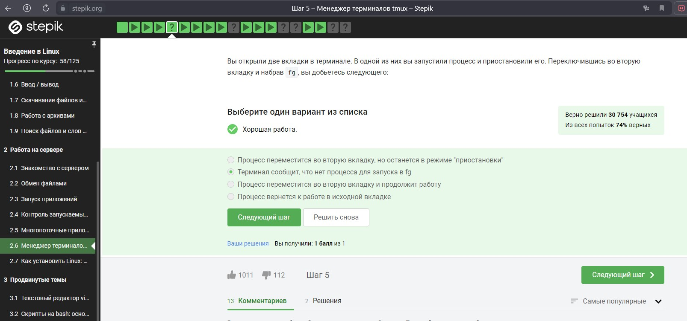{#fig:048 width=70%}

Когда вы вводите команду exit в последней открытой вкладке tmux, это приведет к завершению сеанса tmux, так как больше не останется активных окон.

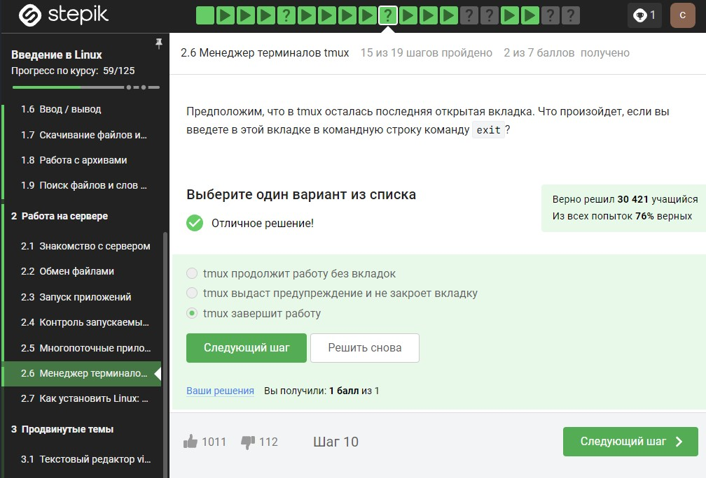{#fig:049 width=70%}

Когда вы закрываете терминал, это приведет к разрыву соединения с сервером, но работа внутри tmux на сервере будет продолжена, поскольку tmux работает в фоновом режиме и сохраняет состояние сессии даже после разрыва соединения.

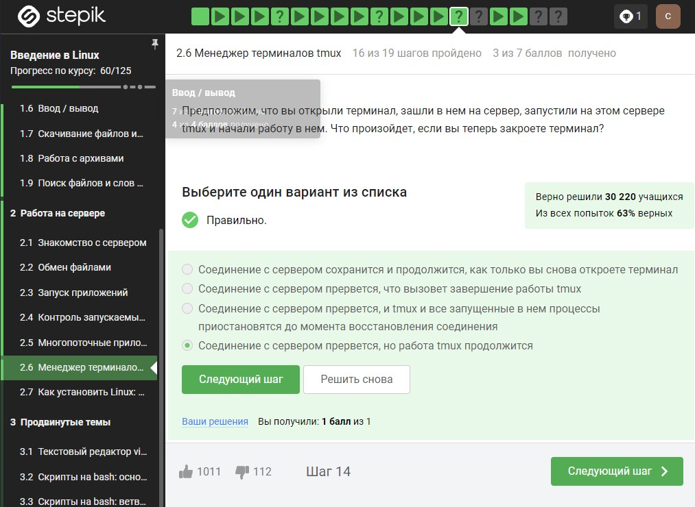{#fig:050 width=70%}

Когда вы закрываете вкладку в tmux комбинацией клавиш `Ctrl+B, X`, tmux закрывает эту вкладку и все процессы, запущенные в ней, завершаются.

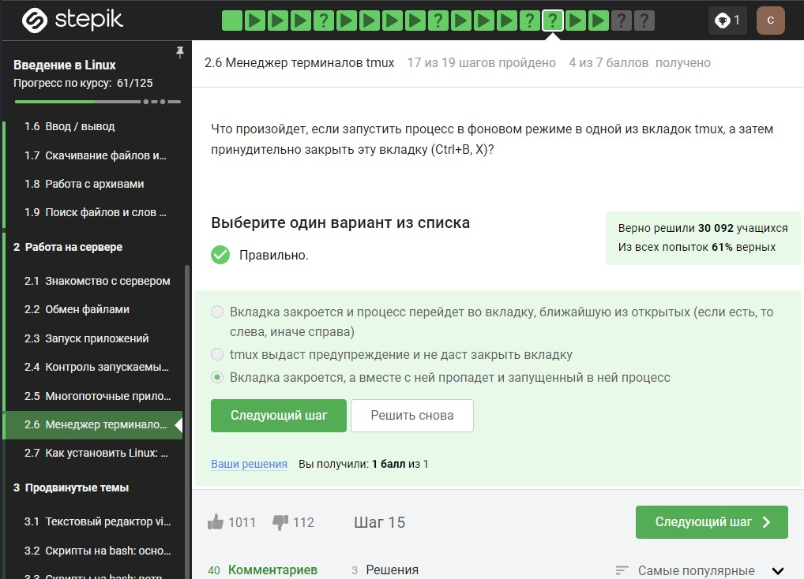{#fig:051 width=70%}

`Ctrl+B и ,` - это комбинация клавиш для переименования текущей вкладки в tmux.

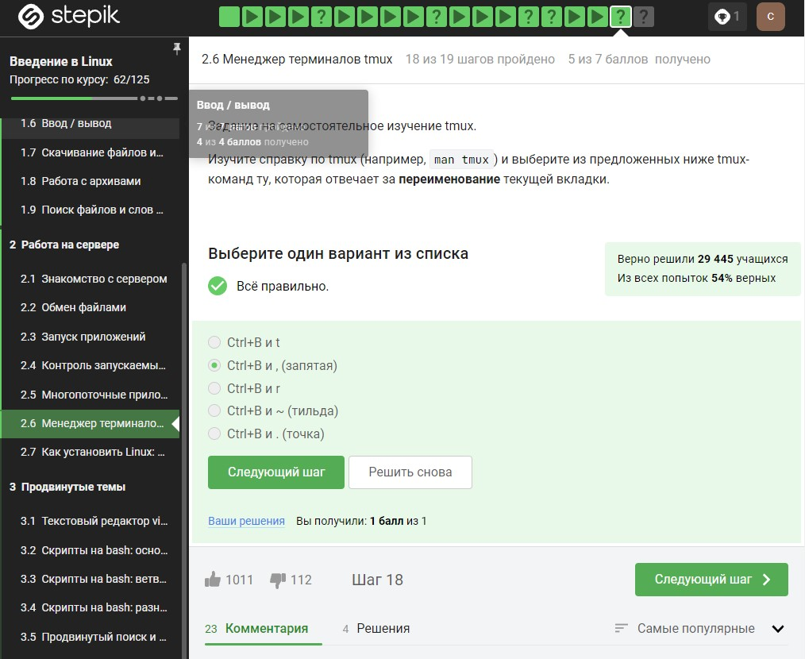{#fig:052 width=70%}

1. **Вкладку можно разделить и горизонтально, и вертикально**: tmux позволяет разделять вкладки как по горизонтали, так и по вертикали, что дает возможность создавать различные макеты для параллельной работы.

2. **Можно закрыть одну из "частей" вкладки**: tmux позволяет закрывать "части" вкладок, созданные при разделении, чтобы освободить место для других процессов или визуализации.

3. **Команды-"разделения" действуют только в текущей вкладке tmux**: Каждая команда, связанная с разделением вкладок, применяется только к текущей активной вкладке tmux, что позволяет контролировать разделение и компоновку вкладок в каждом tmux-окне отдельно.

4. **Если разделенную горизонтально вкладку разделить еще и вертикально, то получится 3 "части"**: tmux позволяет комбинировать разделение по вертикали и по горизонтали для создания более сложных макетов, включая три или более "части" в одной вкладке.

Неправильное утверждение о перемещении по половинкам "разделенной" вкладки с помощью стрелок не верно, потому что в tmux для перемещения между "панелями" или "частями" вкладки используются другие комбинации клавиш, а не стрелки.

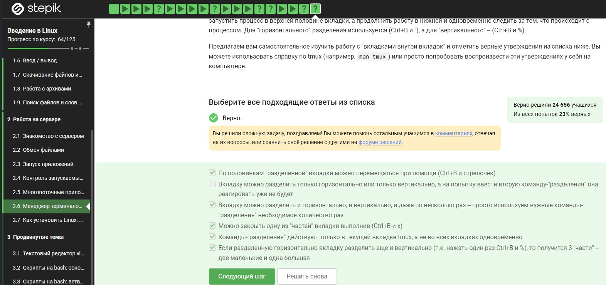{#fig:053 width=70%}

## 3 РАЗДЕЛ

В редакторе Vim команда для выхода из редактора - это :q. Если вы внесли изменения в файл и хотите выйти без сохранения, вы можете использовать команду :q!. После ввода команды нужно нажать клавишу Enter.

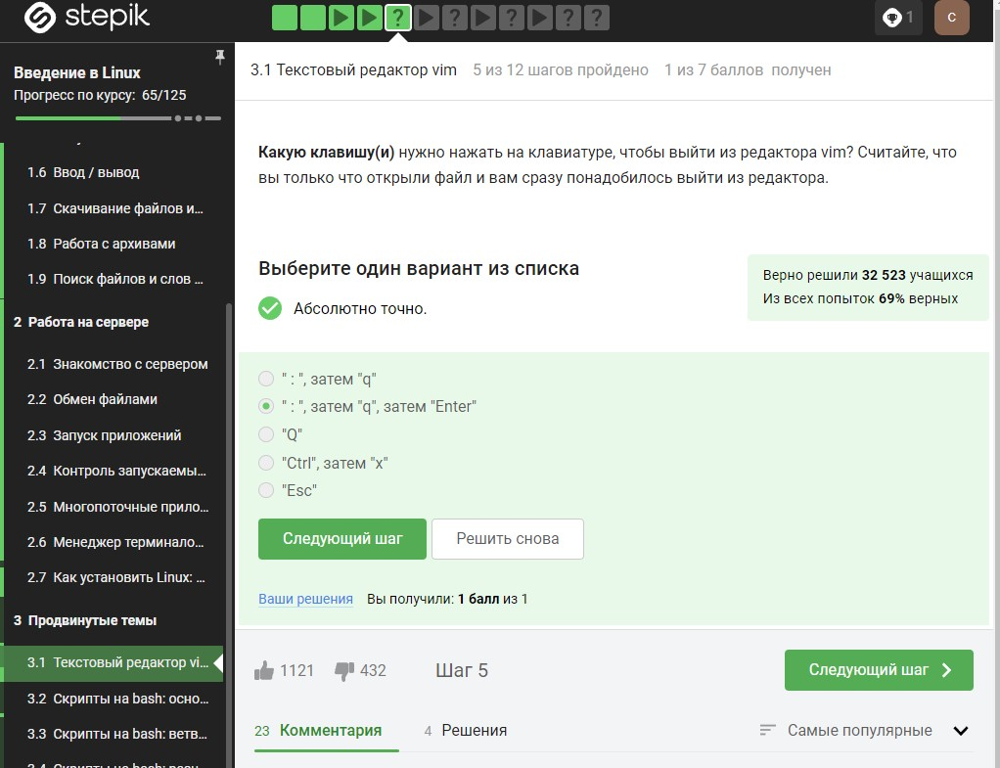{#fig:054 width=70%}

- Разница между `w` и `W` в том, что `w` перемещает курсор по "словам" (word), разделенным пробелами или другими символами пунктуации, а `W` перемещает курсор по "большим словам" (WORD), разделенным пробелами. Таким образом, `W` игнорирует все символы, кроме пробелов.
- После 10 нажатий на `W` курсор действительно окажется на том же месте, где был бы после 10 нажатий на `w`, если строки не содержат "больших слов".

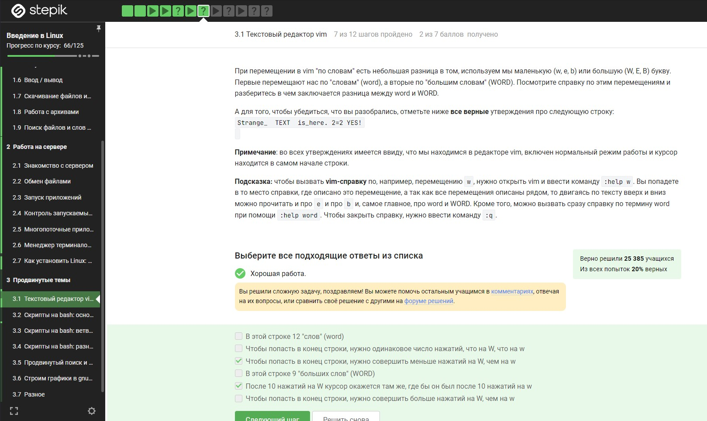{#fig:055 width=70%}


- В первом наборе клавиш `d2wwywPp` сначала удаляются два слова (two и three), затем курсор перемещается к слову "four", оно копируется (`yw`), а затем вставляется дважды (`Pp`).
- Во втором наборе клавиш `d2w$$bifour four <<Esc>>` сначала удаляются два слова (one и two), затем курсор перемещается к концу строки (`$$`), после чего вставляется "four four four" перед словом "five".

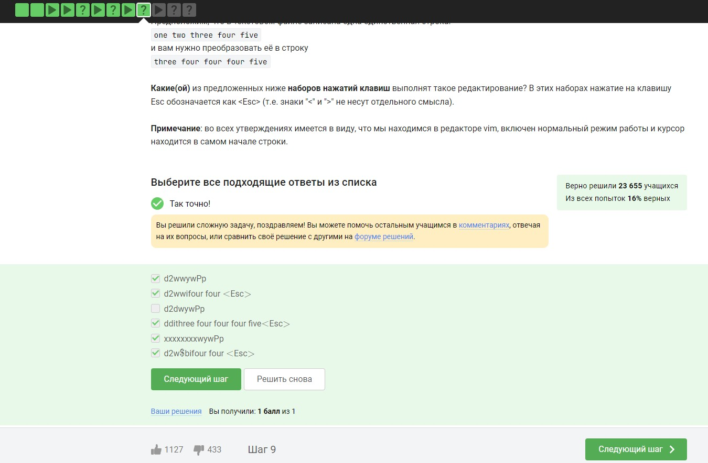{#fig:056 width=70%}


- `%` означает, что замена будет производиться во всем файле.
- `s/Windows/Linux/` означает замену строки "Windows" на "Linux".
- `g` означает, что замена будет производиться глобально в каждой строке, то есть все вхождения "Windows" в каждой строке будут заменены на "Linux", а не только первое.

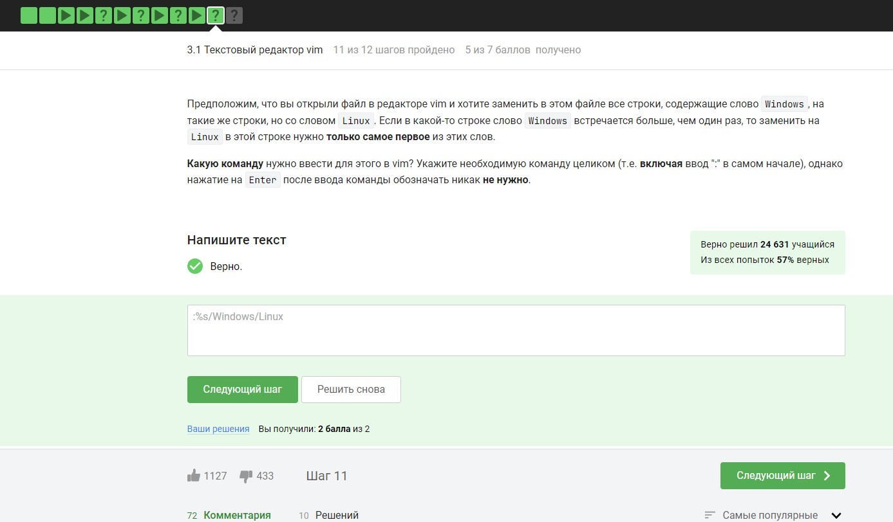{#fig:057 width=70%}

Когда вы находитесь в нормальном режиме Vim и нажимаете клавишу "v", вы входите в режим выделения (Visual). В этом режиме вы можете выделять текст, используя клавиши перемещения или другие команды, такие как W, e, $. Выделенный текст будет подсвечен, и внизу редактора будет отображаться надпись "VISUAL", указывающая на то, что вы находитесь в режиме выделения.

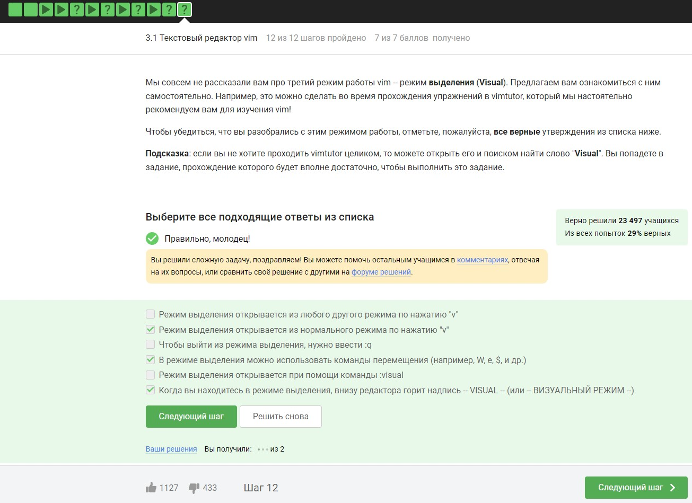{#fig:058 width=70%}

Когда вы используете стрелки вверх/вниз для перемещения по истории набранных команд в терминале, это обычно означает, что вы перемещаетесь по истории команд текущей оболочки. В вашем случае, когда вы запускаете оболочку `sh` из `bash`, а затем запускаете `bash` из `sh`, и набираете команды в каждой из этих оболочек, истории этих оболочек будут независимыми.

Таким образом, когда вы попытаетесь использовать стрелки вверх/вниз в последней оболочке (`bash`), вы будете перемещаться только по истории команд этой оболочки, то есть по набору С.

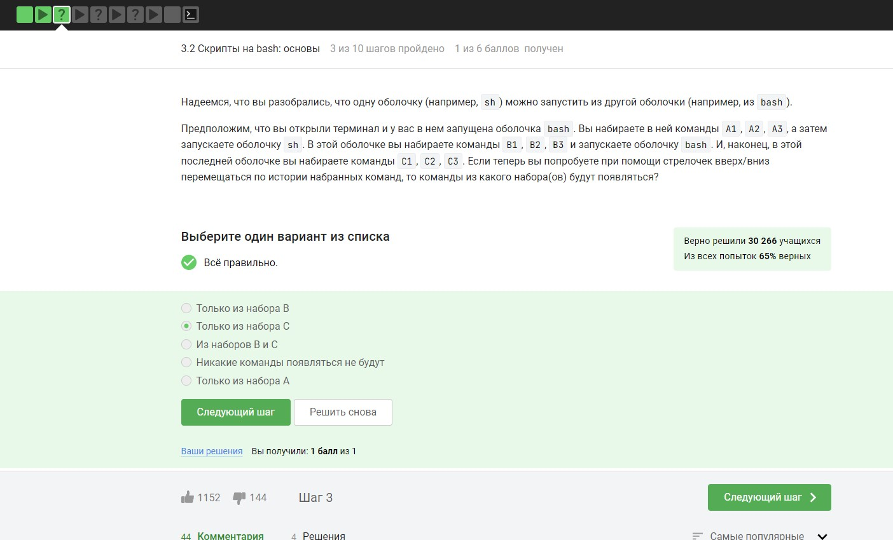{#fig:059 width=70%}

После выполнения скрипта, создание файла file1.txt произойдет в директории, указанной перед командой `touch`, которая будет `/home/bi/`, так как перед командой `cd` указан абсолютный путь `/home/bi/`.

Следовательно, абсолютный путь до созданного файла file1.txt будет `/home/bi/file1.txt`.

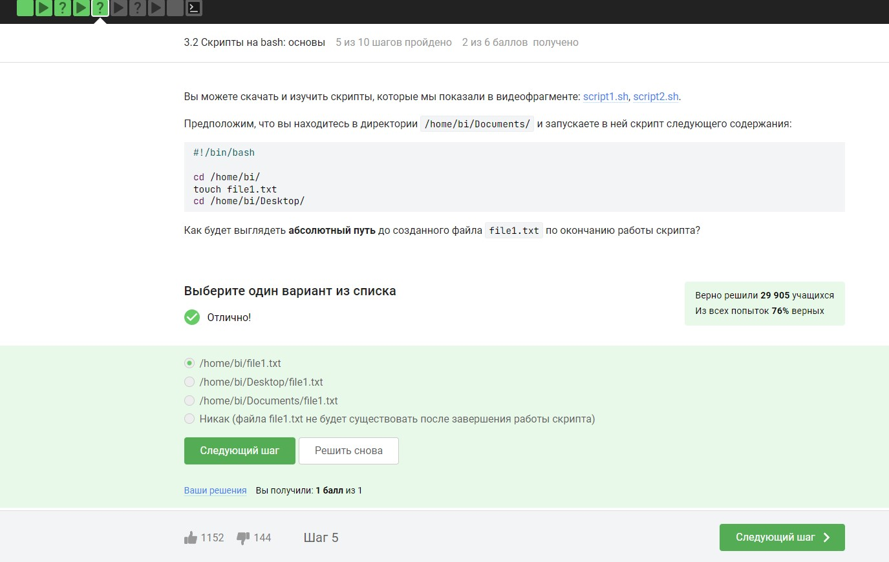{#fig:060 width=70%}

Да, `variable_123` может быть именем переменной в bash. В Bash переменные могут содержать буквы (в верхнем или нижнем регистре), цифры и символ подчеркивания, и должны начинаться с буквы или символа подчеркивания.

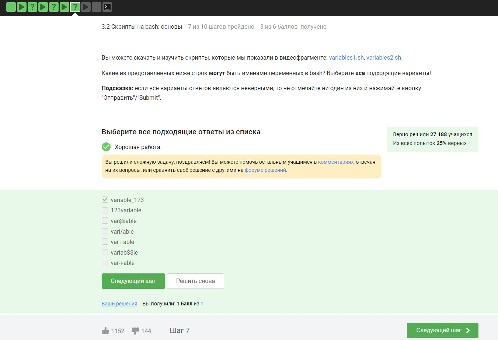{#fig:061 width=70%}

В данном скрипте:

1. `#!/bin?/bash`: Эта строка указывает на путь к оболочке (в данном случае, к Bash). Обычно она начинает исполняемый скрипт и сообщает системе, какую оболочку нужно использовать для его выполнения. Ошибка в написании пути (неправильно написано `#!/bin?/bash`) может привести к неправильному выполнению скрипта или ошибке "Неверный интерпретатор".

2. `var1=$1` и `var2=$2`: Здесь переменным `var1` и `var2` присваиваются значения первого и второго аргументов командной строки соответственно. Переменная `$1` содержит первый аргумент, а `$2` содержит второй.

3. `echo "Arguments are: \$1=$var1 \$2=$var2"`: Эта строка выводит сообщение в стандартный вывод. В ней используется экранирование символов `\$1` и `\$2`, чтобы они интерпретировались как текст, а не как переменные. В результате выводится строка "Arguments are: $1=значение_первого_аргумента $2=значение_второго_аргумента", где значения переменных заменяются на фактические значения первого и второго аргументов, переданных скрипту при его запуске.

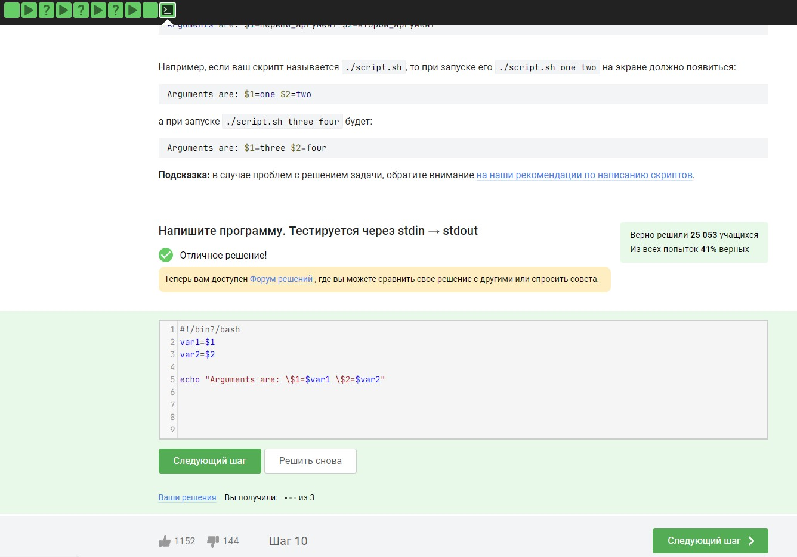{#fig:062 width=70%}

- `5 -ge 5`: Это условие проверяет, является ли число 5 больше или равным 5. В данном случае, 5 равно 5, поэтому условие верно.

- `-e $0`: Это проверка существования файла с именем, указанным в переменной `$0`. В `$0` хранится имя скрипта, который выполняется. Если файл существует, то выражение вернет true.

- `-s $0`: Это проверка на непустоту файла с именем, указанным в переменной `$0`. Если файл существует и он не пустой, то выражение вернет true.

- `! (4 -le 3)`: Это отрицание условия "4 меньше или равно 3". Поскольку это условие ложно, то его отрицание будет истинным.

- `$# -ge 0`: Это проверка количества переданных в скрипт аргументов. Если количество аргументов больше или равно 0, то условие верно.

- `$`: Это специальный символ, обозначающий имя переменной в bash. В данном контексте, он не имеет смысла как условие.

- `$var1 == `: Это некорректное выражение, так как оператор сравнения равенства (`==`) должен быть справа от значения переменной.

- `$var2 || `: Это некорректное выражение, так как логический оператор "или" (`||`) должен иметь значение справа от него.

- `$var1 != `: Это некорректное выражение, так как оператор сравнения неравенства (`!=`) должен быть справа от значения переменной.

- `$var2`: Это имя переменной, но без дополнительного контекста, это не является условием.

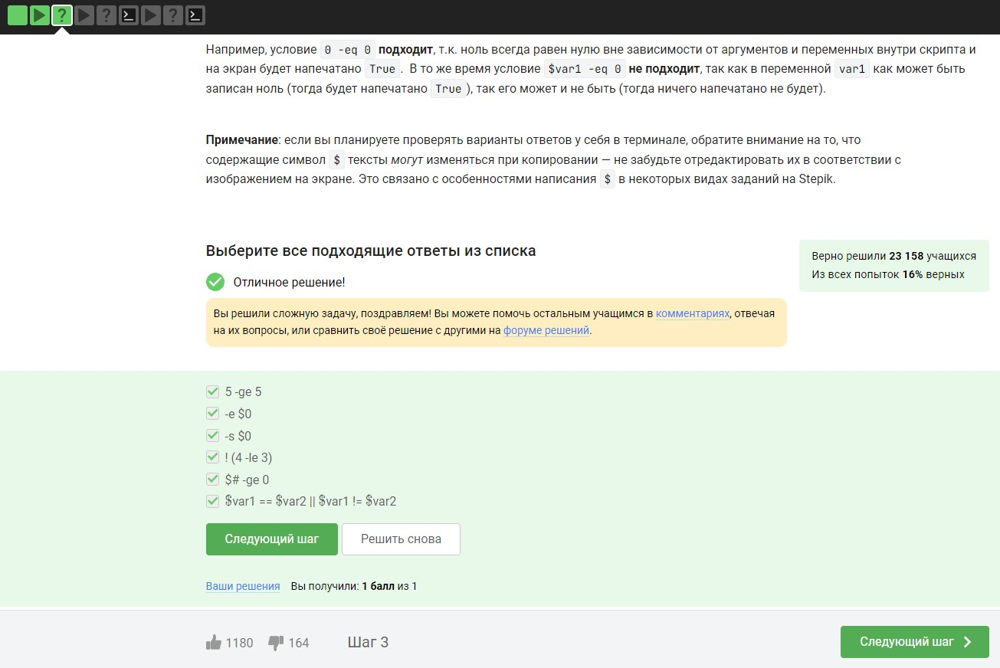{#fig:063 width=70%}

Когда переменная `var` установлена в 3, скрипт выведет "four", так как это значение не удовлетворяет ни одному из условий в if-elif-else блоке.

Когда переменная `var` установлена в 5, скрипт также выведет "four". Важно понимать, что после выполнения первого подходящего условия в if-elif-else блоке, остальные условия проверяться не будут. Так как первое условие `[[ $var -gt 5 ]]` вернет false для `var=5`, скрипт перейдет к следующему условию. Но так как в этом случае все остальные условия тоже не будут удовлетворены (поскольку `var=5` не меньше 3 и не равно 4), то будет выполнена ветвь else и выведено "four".

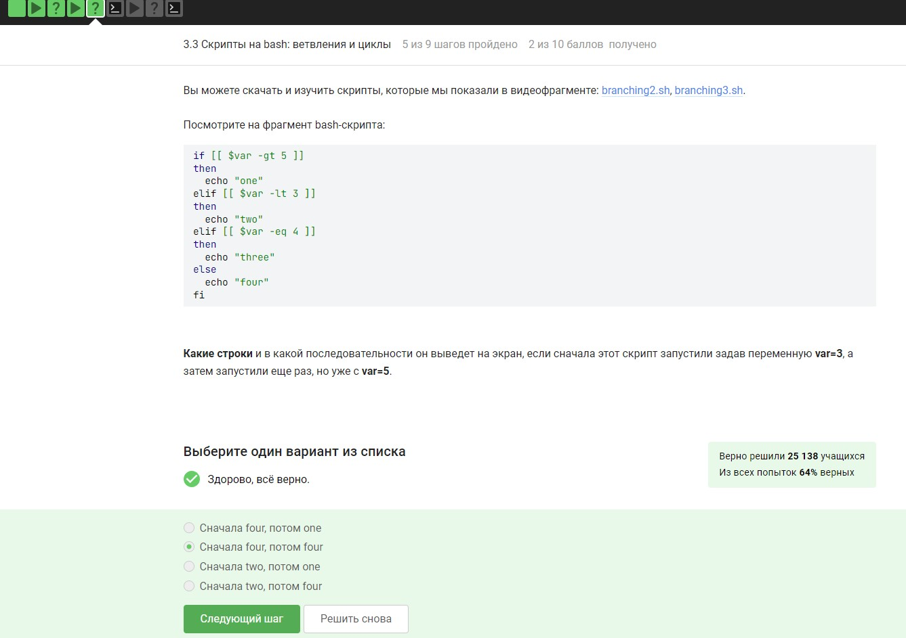{#fig:064 width=70%}

Этот скрипт на bash является примером использования оператора `case` для выбора действия на основе значения переменной.

1. `#!/bin/bash`: Это шебанг, который указывает на то, что скрипт должен быть интерпретирован с использованием оболочки bash.

2. `v=student`: Здесь переменной `v` присваивается значение "student". Это общая часть, которая будет использоваться в каждом выводе.

3. `case $1 in`: Это начало блока `case`, который будет проверять значение первого аргумента (`$1`), переданного скрипту при запуске.

4. `0) res="No ${v}s";;`: Если значение `$1` равно 0, переменной `res` присваивается строка "No students".

5. `1) res="$1 ${v}";;`: Если значение `$1` равно 1, переменной `res` присваивается строка "1 student".

6. `[2-4]) res="$1 ${v}s";;`: Если значение `$1` находится в диапазоне от 2 до 4 включительно, переменной `res` присваивается строка вида "2 students", "3 students" или "4 students".

7. `*) res="A lot of ${v}s";;`: Если значение `$1` не соответствует ни одному из вышеперечисленных случаев, переменной `res` присваивается строка "A lot of students".

8. `esac`: Завершает блок `case`.

9. `echo "$res"`: Выводит содержимое переменной `res` в стандартный вывод.

Таким образом, этот скрипт анализирует значение первого аргумента, переданного при запуске скрипта, и в зависимости от этого значения формирует строку вывода, указывающую на количество студентов.

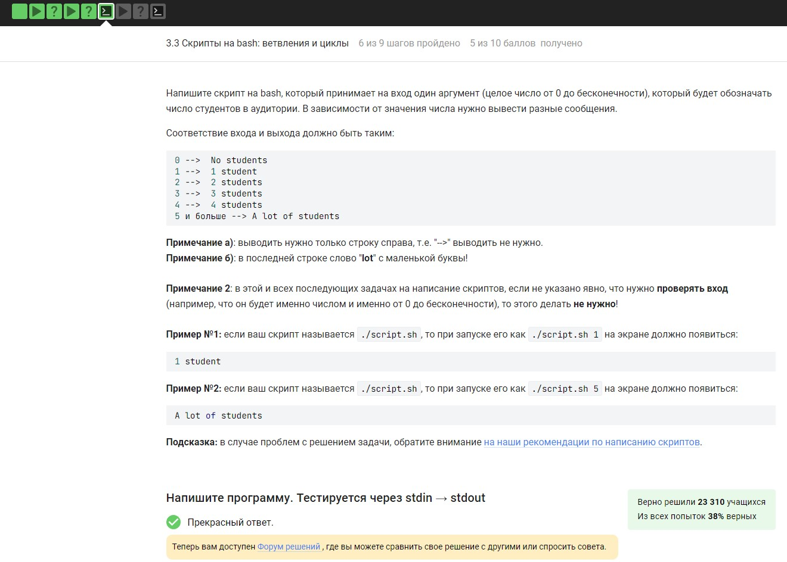{#fig:065 width=70%}


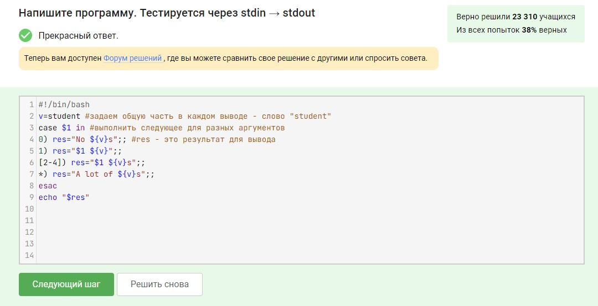{#fig:066 width=70%}

В данном скрипте используется цикл `for`, который перебирает элементы в списке строк "a", ",", "b", ",", "c_d". В каждой итерации цикла сначала выводится слово "start", а затем выполняется проверка условия `if`.

1. Когда переменная `str` равна "a", условие `$str > "c"` не выполняется, поэтому выводится "start", а затем "finish".
2. Когда переменная `str` равна ",", также выполняется вывод "start" и "finish".
3. Когда переменная `str` равна "b", также выполняется вывод "start" и "finish".
4. Когда переменная `str` равна ",", также выполняется вывод "start" и "finish".
5. Когда переменная `str` равна "c_d", условие `$str > "c"` выполняется (поскольку "c_d" больше, чем "c"), и выполняется оператор `continue`, который прерывает текущую итерацию цикла и переходит к следующей строке.
6. Когда переменная `str` равна "", условие `$str > "c"` не выполняется, поэтому выводится "start", а затем "finish".

Таким образом, слово "start" будет выведено 5 раз, а слово "finish" будет выведено 4 раза.

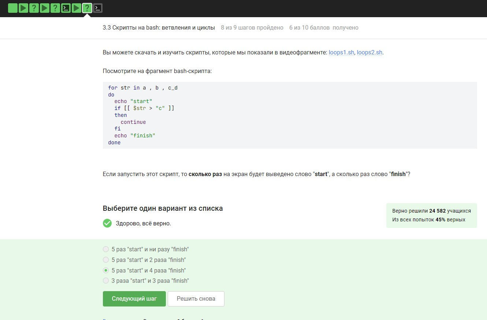{#fig:067 width=70%}

Этот скрипт представляет собой пример использования циклов `while`, условных операторов `if-elif-else` и операторов сравнения в bash.

1. На первых трех строках определяются переменные `child`, `adult`, и `stdout`, которые устанавливаются в определенные значения.
2. Далее следует основной цикл `while`, который будет выполняться, пока значение переменной `stdout` не станет равным 1.
3. Внутри цикла выводится приглашение ввести имя (`"enter your name: "`) и считывается введенное значение в переменную `name`.
4. Затем выполняется проверка условий:
   - Если введенное имя пусто или равно 0, то выводится "bye", переменная `stdout` устанавливается в 1, и программа завершает работу.
   - Если введенное имя не пусто, то вводится возраст (`"enter your age: "`), который сохраняется в переменную `age`.
5. После этого идет вложенный цикл `while`, который также выполняется, пока значение переменной `stdout` не станет равным 1.
6. Внутри вложенного цикла проверяется возраст:
   - Если возраст равен 0 или пуст, то выводится "bye", `stdout` устанавливается в 1, и программа завершает работу.
   - Если возраст меньше или равен значению переменной `child`, выводится соответствующее сообщение о принадлежности к группе "child".
   - Если возраст больше значения переменной `adult`, выводится сообщение о принадлежности к группе "adult".
   - В остальных случаях проверяется, попадает ли возраст в диапазон от 17 до 25 лет. Если да, выводится сообщение о принадлежности к группе "youth".
7. После каждой итерации вложенного цикла выполняется оператор `break`, который прерывает выполнение вложенного цикла и переходит к следующей итерации основного цикла.
8. Если введено имя, но не введен возраст, программа просто вернется к вводу возраста.
9. Если введен возраст, программа завершит работу, только если возраст равен 0 или пуст.

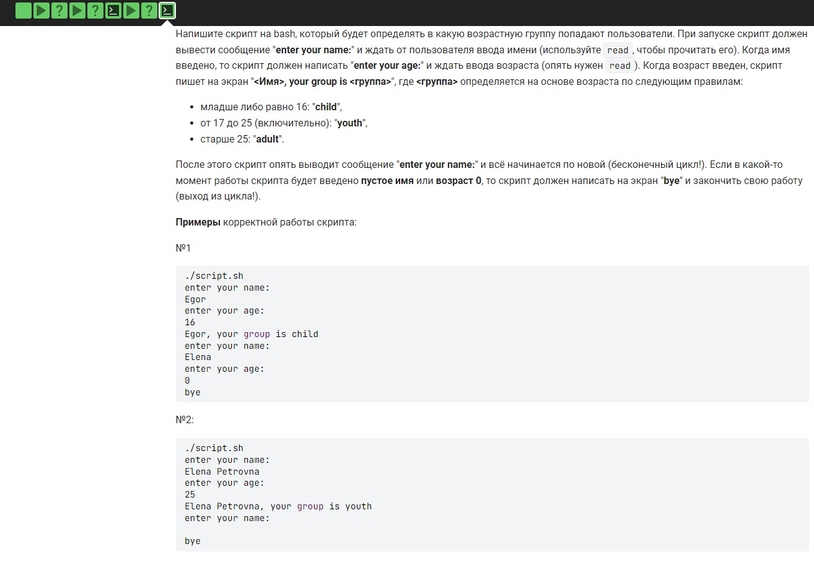{#fig:068 width=70%}


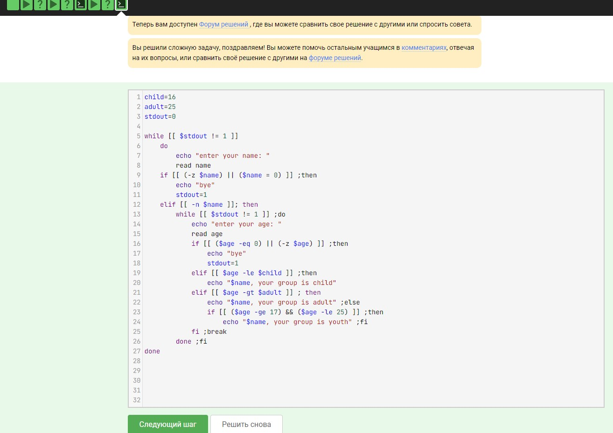{#fig:069 width=70%}

Эти варианты представляют собой арифметические операции сложения значений переменных `a` и `b` и записи результата в переменную `a`.

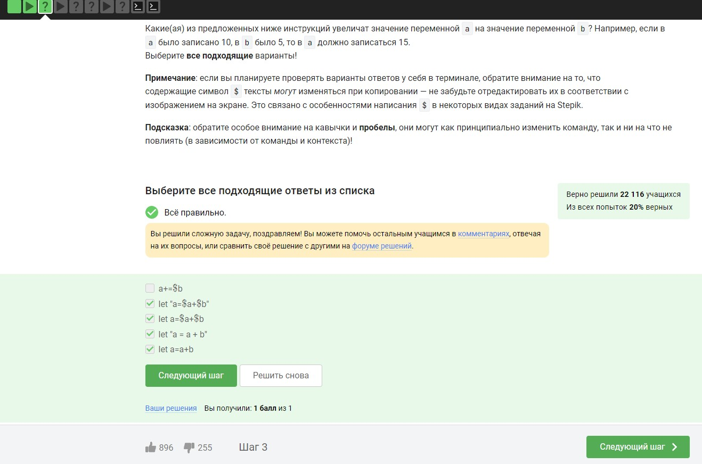{#fig:070 width=70%}

Команда `echo` выведет на экран строку, которая будет результатом выполнения команды `pwd`, которая возвращает текущий рабочий каталог. В данном случае скрипт сначала переходит в каталог /home/bi/, а затем выводит его полный путь с помощью команды `pwd`. 

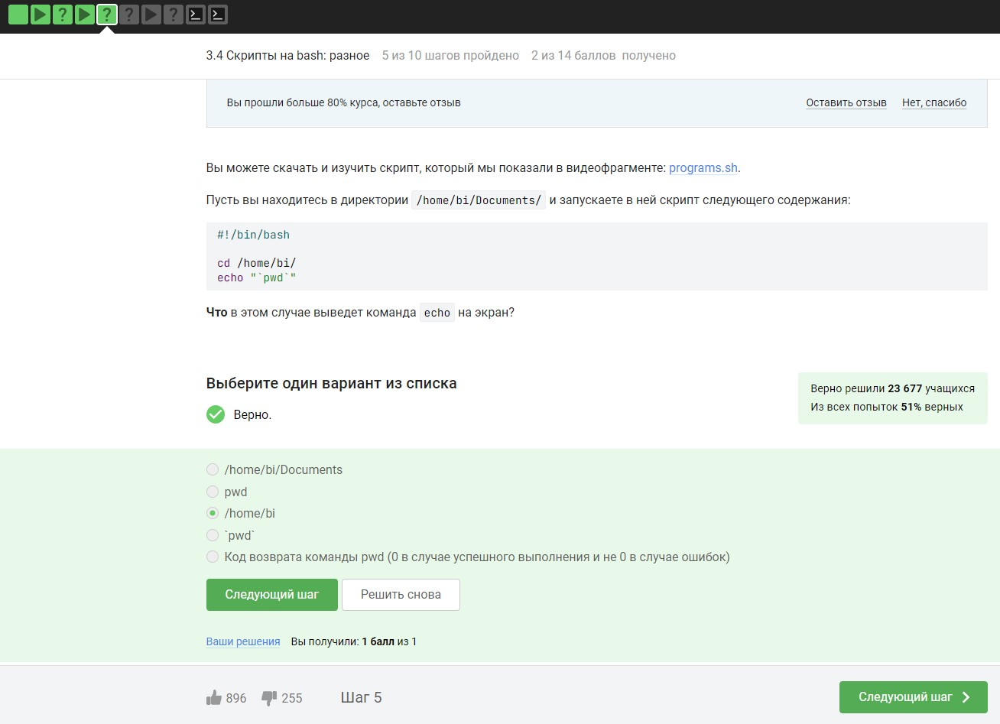{#fig:071 width=70%}

В случае, когда нужно сначала выполнить программу и затем проверить её код возврата, можно использовать следующую конструкцию:

```bash
program
if [[ $? -eq 0 ]]
then
    # Ваши действия, если код возврата программы равен 0
fi
```

Если же программа пишет что-то в stdout, но вам нужно все-таки проверить её код возврата, можно перенаправить вывод в файл и затем прочитать этот файл в условии if. Однако, это может быть неэффективным, особенно если вывод программы большой или если вы не хотите сохранять вывод в файл. Вот пример:

```bash
if program > output.txt ; then
    # Ваши действия, если код возврата программы равен 0
fi
```

В этом случае программа `program` будет запущена, её вывод будет перенаправлен в файл `output.txt`, и затем код возврата будет проверен в условии if.

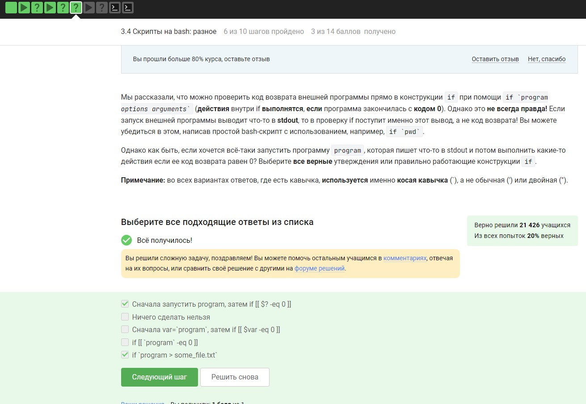{#fig:072 width=70%}

Строка, которую выведет на экран команда `echo "counters are $c1 and $c2"`, если она находится в скрипте после десяти вызовов функции `counter` с параметрами сначала 1, затем 2, затем 3 и т.д., последний вызов с параметром 10, будет:

```
counters are 55 and 110
```

Пояснение:
- Первый вызов функции `counter` с параметром 1 увеличит `c1` на 1, а `c2` на 2 (т.к. `c2` умножается на 2 при каждом вызове).
- Второй вызов функции `counter` с параметром 2 увеличит `c1` на 2, а `c2` на 4.
- И так далее, до последнего вызова функции `counter` с параметром 10, который увеличит `c1` на 10, а `c2` на 20.

Итак, `c1` будет равен сумме чисел от 1 до 10, что равно 55, а `c2` будет равен удвоенной сумме этих чисел, т.е. 110.

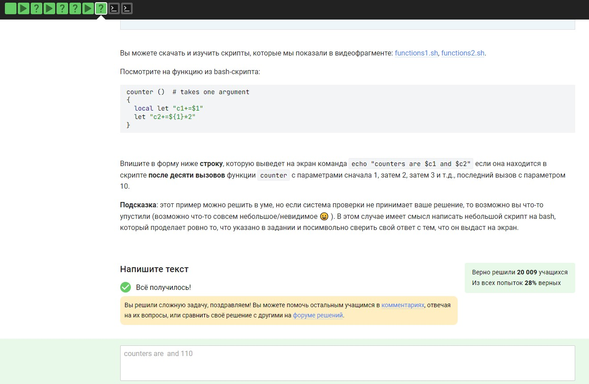{#fig:073 width=70%}

Этот скрипт на языке оболочки Bash вычисляет наибольший общий делитель (НОД) двух чисел, введенных пользователем во время выполнения скрипта. 

Основная часть скрипта находится внутри бесконечного цикла `while`, который будет выполняться до тех пор, пока условие `[ true ]` истинно. 

- Сначала скрипт считывает два числа `n1` и `n2`, введенные пользователем с клавиатуры.
- Далее идет проверка на пустоту переменной `n1` при помощи условного оператора `if [ -z $n1 ]`. Если `n1` пусто (т.е. пользователь ничего не ввел и просто нажал Enter), то выводится сообщение "bye", и цикл завершается с помощью команды `break`.
- Если `n1` не пусто, тогда создается функция `gcd` (наибольший общий делитель), которая используется для вычисления НОД двух чисел. 
- Функция `gcd` использует алгоритм Евклида для вычисления НОД. Он состоит в последовательных делениях, пока не получится нулевой остаток. 
- После завершения работы функции выводится сообщение "GCD is $n1", где `$n1` содержит значение НОД двух введенных чисел.

Итак, скрипт будет продолжать запрашивать ввод двух чисел и вычислять их НОД до тех пор, пока пользователь не введет пустую строку (нажмет Enter).

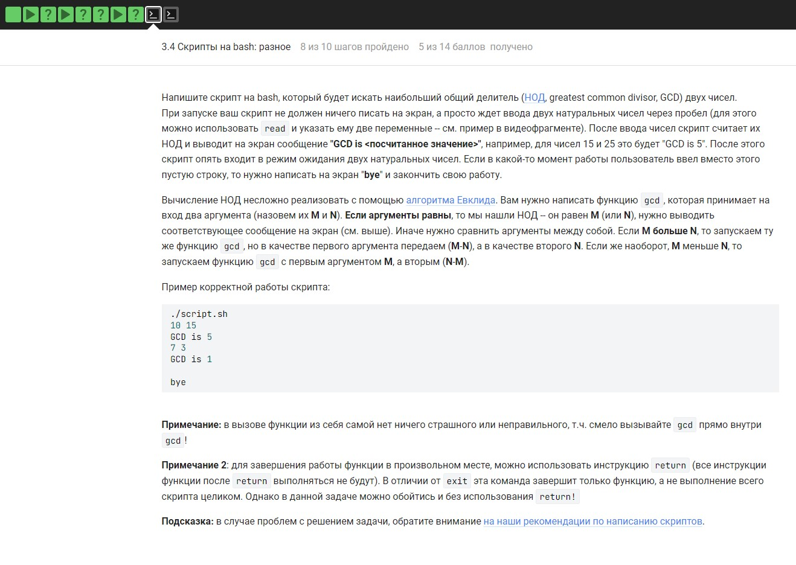{#fig:074 width=70%}

{#fig:075 width=70%}

Этот скрипт работает следующим образом:
- В бесконечном цикле `while true` происходит чтение ввода пользователя с помощью команды `read`.
- После этого проверяется, является ли первый операнд строкой "exit". Если это так, то выводится "bye" и цикл завершается.
- Затем проверяется, содержат ли оба операнда целые числа. Если нет, выводится "error" и цикл завершается.
- Если оба операнда являются целыми числами, то в зависимости от оператора (`+`, `-`, `*`, `/`, `%`, `**`) производится соответствующая математическая операция.
- Результат операции выводится на экран.
- Если оператор не соответствует ни одной из допустимых операций, выводится "error" и цикл завершается.

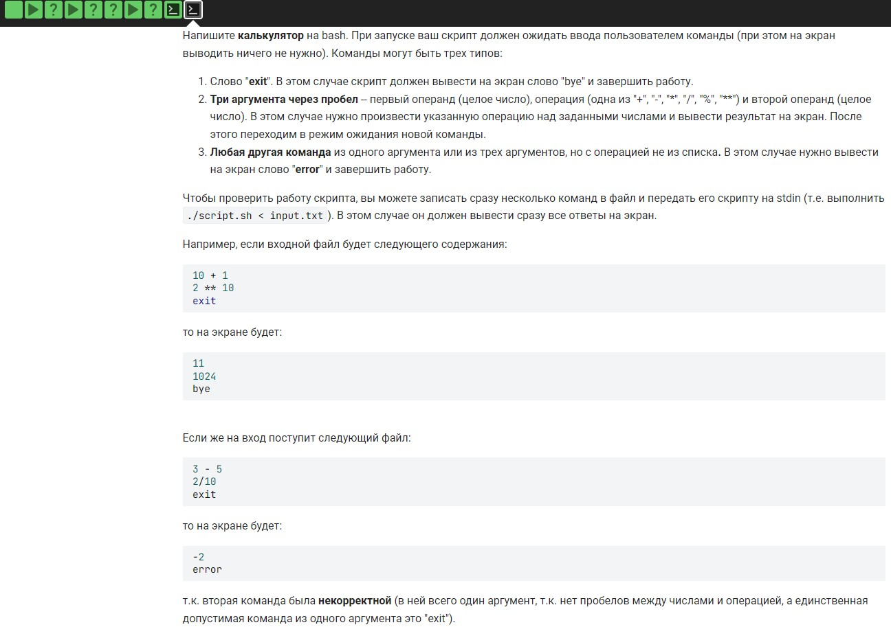{#fig:076 width=70%}


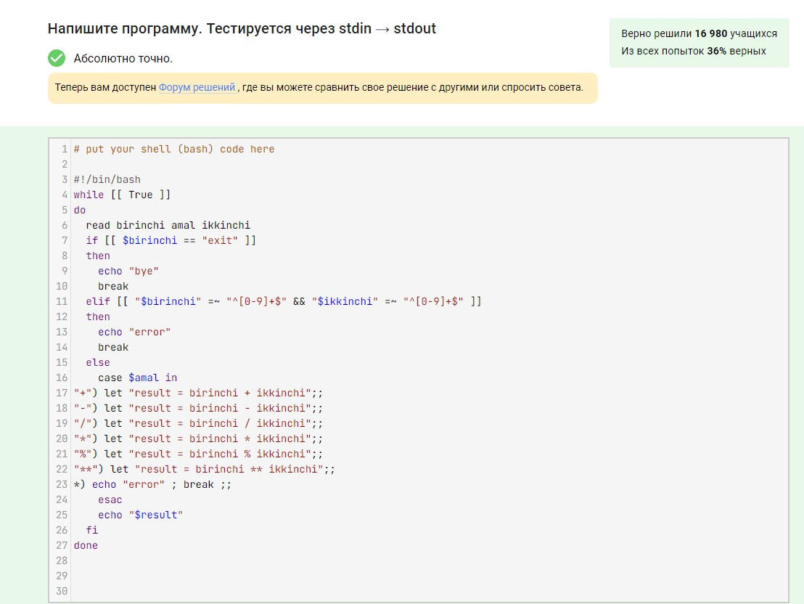{#fig:077 width=70%}

Команда `find /home/bi -iname "star*"` найдет все файлы, начинающиеся с "star" без учета регистра, поэтому она найдет файлы, такие как "Star_Wars.avi", "star_trek_OST.mp3", "STARS.txt" и "stardust.mpeg".

С другой стороны, команда `find /home/bi -name "star*"` найдет только те файлы, начинающиеся с "star" с учетом регистра, поэтому она пропустит файлы "STARS.txt" и "Star_Wars.avi".

Таким образом, файлы, которые найдет первая команда, но не найдет вторая, это "STARS.txt" и "Star_Wars.avi".

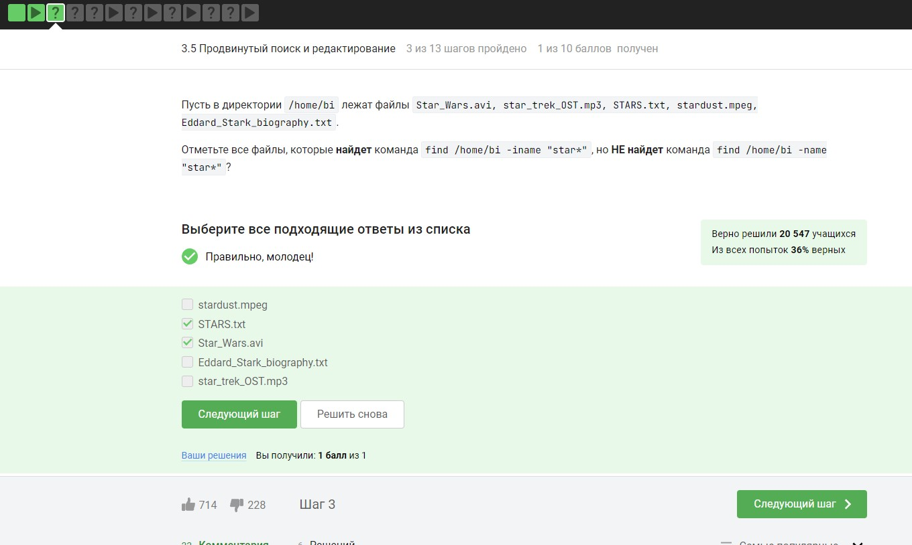{#fig:078 width=70%}

1. Если заменить в команде поиска -name на -path, то результат поиска иногда может остаться таким же. - **Верно.** Это связано с тем, что обе опции (-name и -path) используются для сопоставления имени файла, но -name ищет только в имени файла, тогда как -path ищет в полном пути к файлу. Если имена файлов не содержат пути, замена -name на -path не повлияет на результат поиска.


2. В некоторых случаях find с -name найдет меньше файлов, чем find с таким же запросом, но с -path. - **Верно.** Это может произойти, если искомые файлы находятся во вложенных директориях, и их имена включают в себя определенную строку, которая не является именем самого файла, но присутствует в пути к файлу. В этом случае -path найдет больше файлов, чем -name.

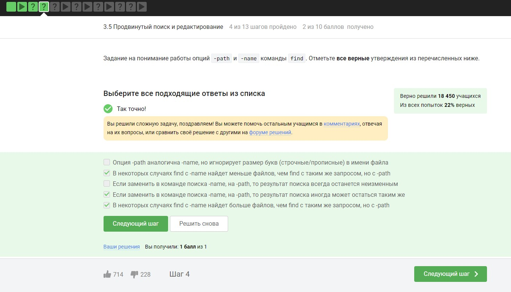{#fig:079 width=70%}

Команда `find /home/bi -mindepth 2 -maxdepth 3 -name "file*"` будет искать файлы в директории /home/bi/ и ее поддиректориях с глубиной от 2 до 3 уровней и с именем, начинающимся на "file".

1. **file1**: Будет найден, так как он находится на уровне глубины 2 и его имя начинается с "file".

2. **file2**: Будет найден, так как он находится на уровне глубины 3 и его имя начинается с "file".

3. **file3**: Не будет найден, так как он находится на уровне глубины 4, который выходит за рамки заданного диапазона глубины.

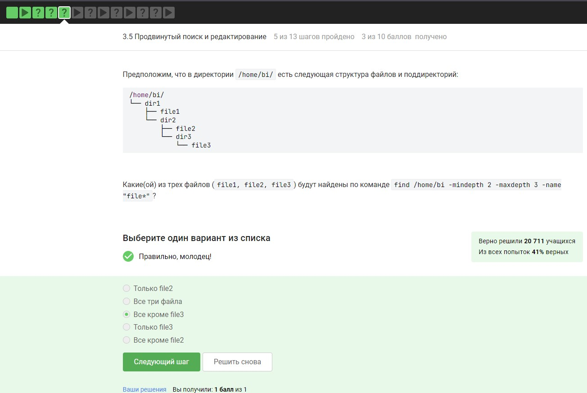{#fig:080 width=70%}

Во всех четырех случаях создание файла `results.txt` приведет к одинаковому размеру, потому что ни одна из команд не изменяет количество символов, записываемых в файл. 

- `grep "word" file.txt > results.txt` запишет все строки, содержащие "word", в `results.txt`.
- `grep -A 1 "word" file.txt > results.txt` запишет все строки, содержащие "word", а также одну следующую строку после каждой строки с "word" в `results.txt`.
- `grep -B 1 "word" file.txt > results.txt` запишет все строки, содержащие "word", а также одну предыдущую строку перед каждой строкой с "word" в `results.txt`.
- `grep -C 1 "word" file.txt > results.txt` запишет все строки, содержащие "word", а также одну предыдущую и одну следующую строку вместе с каждой строкой с "word" в `results.txt`.

Таким образом, все четыре команды создадут файл `results.txt` с одинаковым размером.

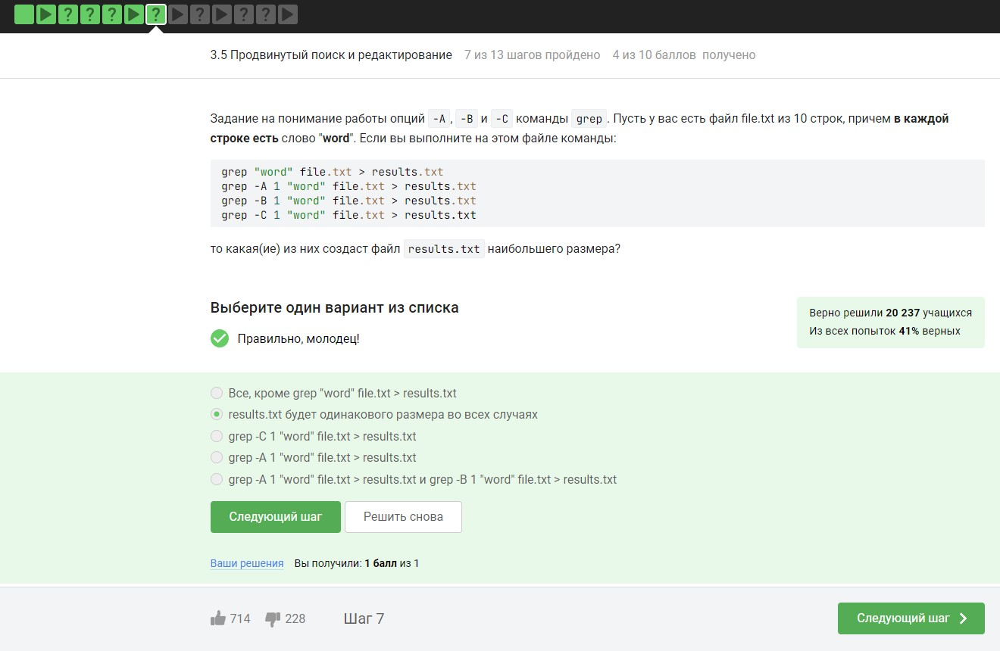{#fig:081 width=70%}

Команда `grep -E "[xklXKL]?[uU]buntu$" text.txt` будет искать строки, которые заканчиваются на "ubuntu" или "Ubuntu", при условии, что перед "ubuntu" или "Ubuntu" может быть один из символов "x", "k", "l", "X", "K", "L".

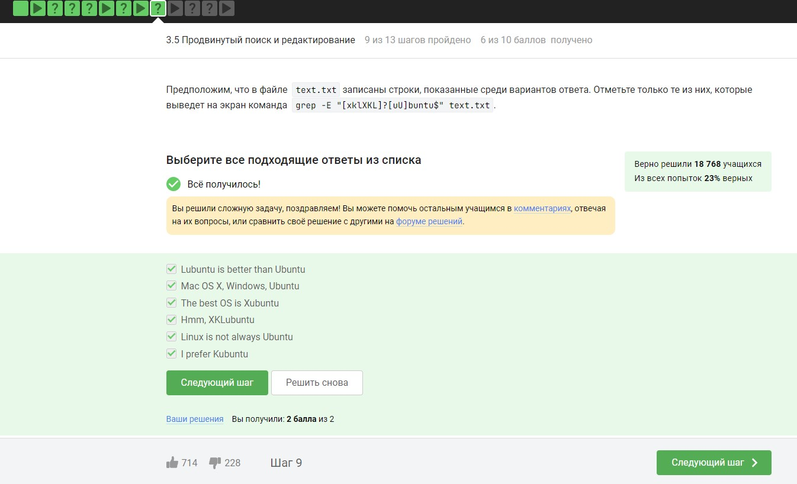{#fig:082 width=70%}

Если в команде `sed "/[a-z]*/p" text.txt` не указывать опцию `-n`, то по умолчанию sed будет выводить каждую строку после ее обработки, вне зависимости от того, была ли она изменена или нет. 

Команда `sed "/[a-z]*/p" text.txt` будет искать строки, которые содержат ноль или более символов в нижнем регистре, и затем печатать их. Однако, поскольку мы не указали `-n`, sed также будет выводить оригинальные строки из файла, которые не были изменены. Это приведет к тому, что каждая строка будет выведена дважды - сначала в исходном виде, а затем после обработки.

Поэтому каждая строка будет выведена два раза.

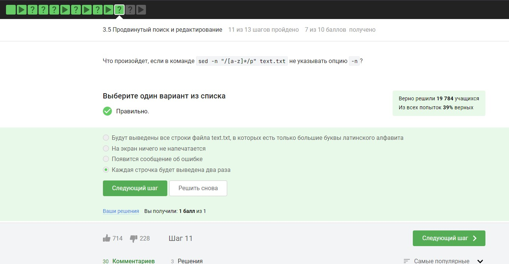{#fig:083 width=70%}

Эта команда `sed` использует регулярное выражение для поиска последовательности символов в верхнем регистре длиной два символа или более, за которыми следует пробел. Затем эта последовательность символов заменяется на строку "abbreviation ". 

Давайте разберем каждый элемент команды подробнее:

1. `sed`: Это утилита Unix/Linux для потокового редактирования текста.
2. `'s/.../.../g'`: Это команда sed для замены. Формат команды замены выглядит как 's/шаблон/замена/флаги'. Здесь `g` означает, что замена должна производиться глобально для каждого вхождения шаблона в строке (то есть не только для первого вхождения).
3. `[A-Z]\{2,\} `: Это регулярное выражение, которое ищет последовательность символов в верхнем регистре (от A до Z) длиной два символа или более (`\{2,\}`). Знак пробела после закрывающей фигурной скобки указывает, что после последовательности символов должен идти пробел.
4. `abbreviation `: Это строка, на которую заменяется найденная последовательность символов. В данном случае, если найдется последовательность символов в верхнем регистре, она будет заменена на "abbreviation ".
5. `g`: Этот флаг указывает на глобальное применение замены ко всей строке. Без этого флага замена будет осуществлена только для первого вхождения шаблона в строке.

Таким образом, данная команда `sed` найдет все последовательности символов в верхнем регистре, состоящие из двух символов или более, за которыми следует пробел, и заменит их на строку "abbreviation " в файле `input.txt`. Результат будет записан в файл `edited.txt`.

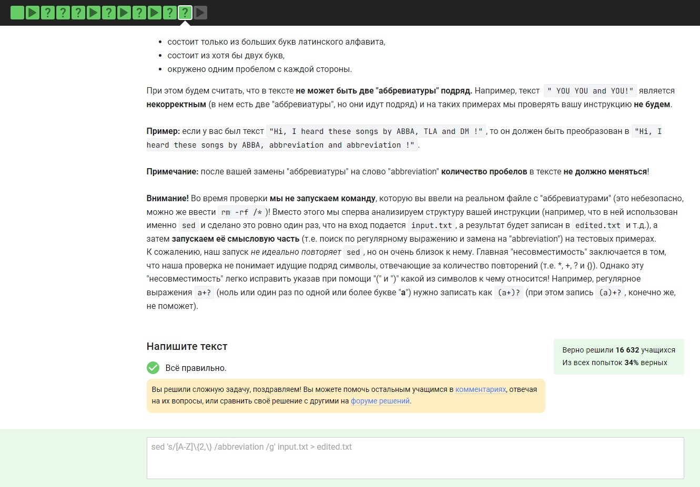{#fig:084 width=70%}

Эта опция позволяет сохранить все нарисованные графики после закрытия gnuplot, таким образом, они не будут автоматически закрыты. Это полезно, если вам нужно сохранить графики для последующего просмотра или анализа.

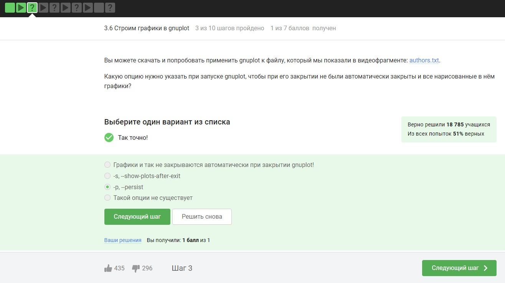{#fig:085 width=70%}

Название ряда данных будет взято из первого значения во втором столбце, так как в данном случае опция `autotitle columnhead` используется для автоматического определения заголовков столбцов. На графике будет нарисовано 9 точек, так как точка из первой строки файла данных будет пропущена при построении графика.

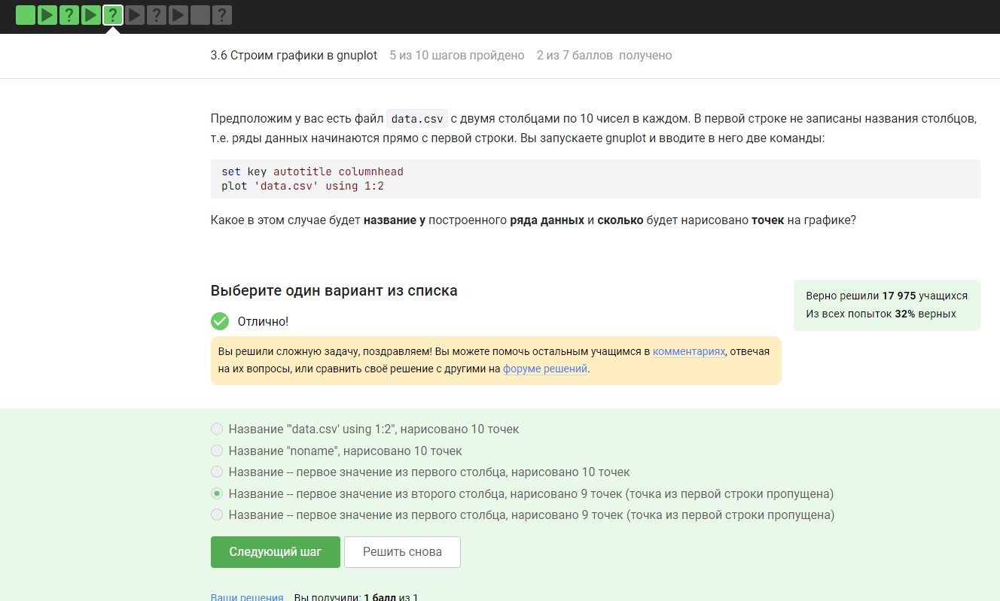{#fig:086 width=70%}

- `"point 1, value ".x1 x1` означает, что для первого деления на оси x будет установлена метка "point 1, value", а ей будет соответствовать значение `x1`.
- `"point 2, value ".x2 x2` означает, что для второго деления на оси x будет установлена метка "point 2, value", а ей будет соответствовать значение `x2`.
- `"point 3, value ".x3 x3` означает, что для третьего деления на оси x будет установлена метка "point 3, value", а ей будет соответствовать значение `x3`.

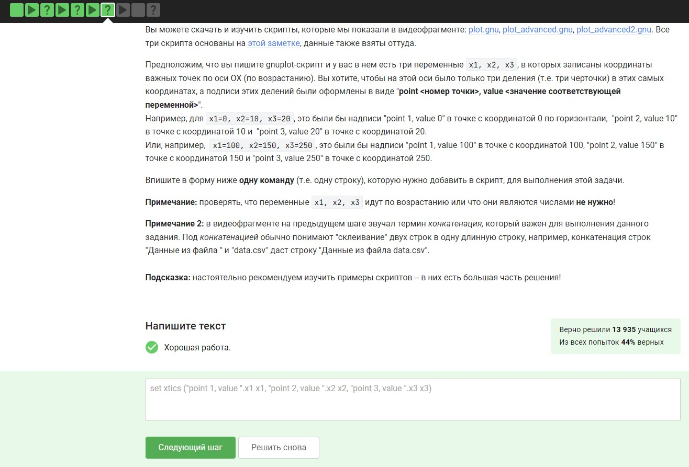{#fig:087 width=70%}

1. `a=a+1`: Эта строка увеличивает переменную `a` на 1.

2. `zrot=(zrot+350)%360`: В этой строке переменная `zrot` увеличивается на 350 и затем берется остаток от деления на 360. Это позволяет создавать эффект вращения вокруг оси Z.

3. `set view xrot,zrot`: Эта команда устанавливает углы поворота вокруг осей X и Z для просмотра графика.

4. `splot -x**2-y**2`: Эта команда строит трехмерный график функции `-x**2-y**2`.

5. `pause 0.1`: Эта команда делает паузу в скрипте на 0.1 секунду.

6. `if (a<50) reread`: Эта строка проверяет условие `a < 50`. Если оно выполняется, то выполняется команда `reread`, которая перечитывает текущий скрипт. Таким образом, скрипт будет выполняться снова и снова, пока `a` меньше 50.

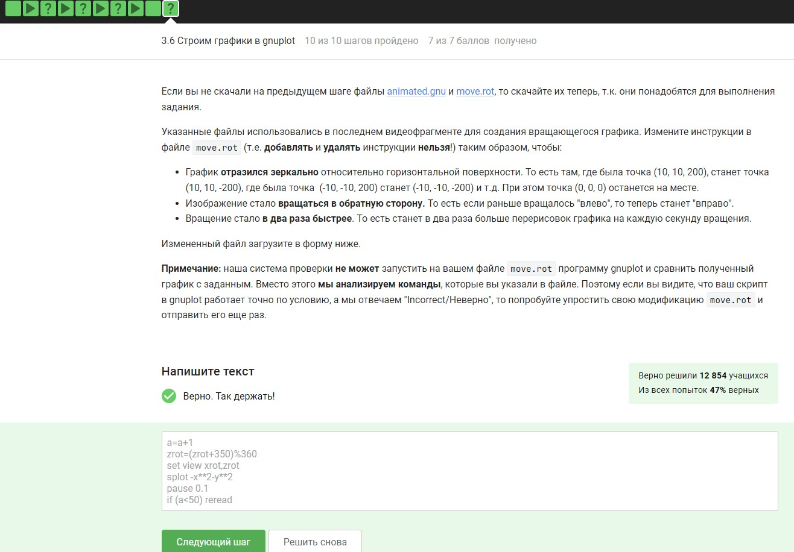{#fig:088 width=70%}

1. `chmod 764 file.txt`: Эта команда устанавливает права доступа на чтение, запись и выполнение для владельца файла (7), на чтение и запись для группы (6) и на чтение для остальных (4).

2. `chmod ug+w file.txt; chmod u+x file.txt`: В этом варианте сначала добавляются права на запись для владельца и группы (`ug+w`), а затем устанавливается право на выполнение только для владельца (`u+x`).

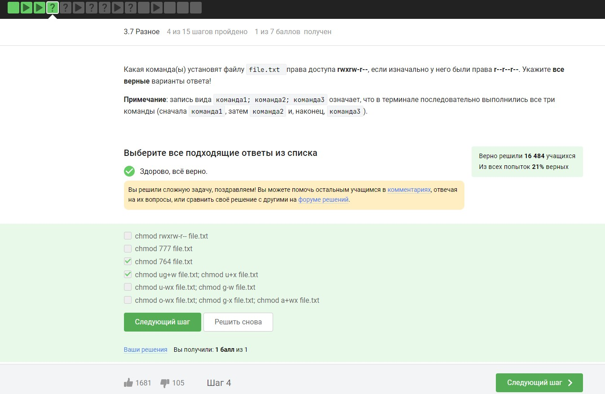{#fig:089 width=70%}

1. `sudo chown user dir`: Эта команда изменит владельца каталога `dir` на пользователя `user`. 

2. `sudo chmod o+w dir`: Эта команда добавит право на запись для остальных (other) пользователей для каталога `dir`.

3. `sudo chown user:group dir`: Эта команда изменит как владельца, так и группу каталога `dir` на `user` и `group` соответственно.

4. `sudo chmod a+w dir`: Эта команда добавит право на запись для всех (владельца, группы и остальных) пользователей для каталога `dir`.

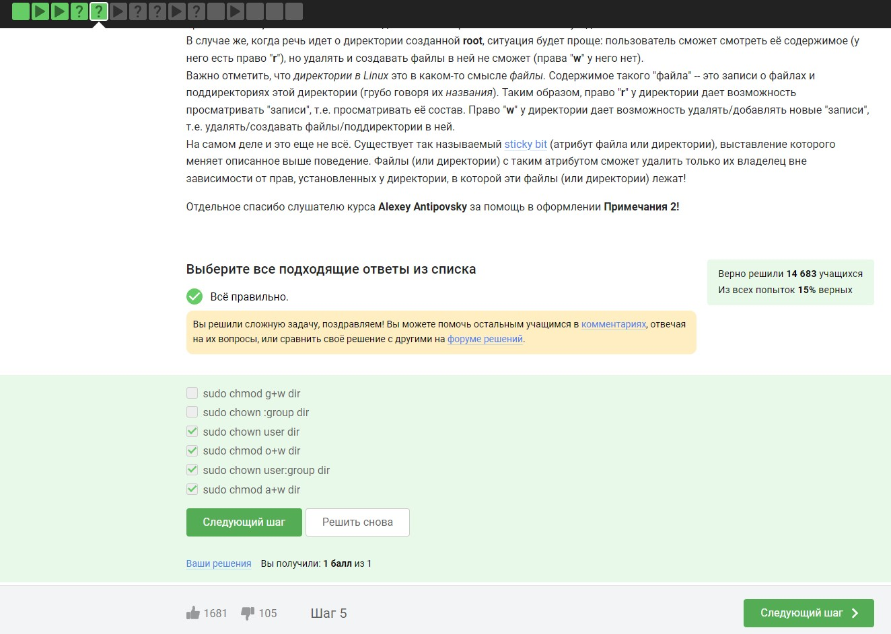{#fig:090 width=70%}

- **Количество символов**: Это общее количество символов в файле, включая пробелы, символы табуляции и символы новой строки.
  
- **Количество слов**: Это количество последовательностей символов, разделенных пробелами, табуляцией или символами новой строки. Обычно слова разделяются пробелами, но команда `wc` считает и другие символы разделителями слов.
  
- **Количество строк**: Это количество строк в файле, где каждая строка заканчивается символом новой строки.
  
- **Размер файла в байтах**: Это общий размер файла в байтах, включая все его содержимое.

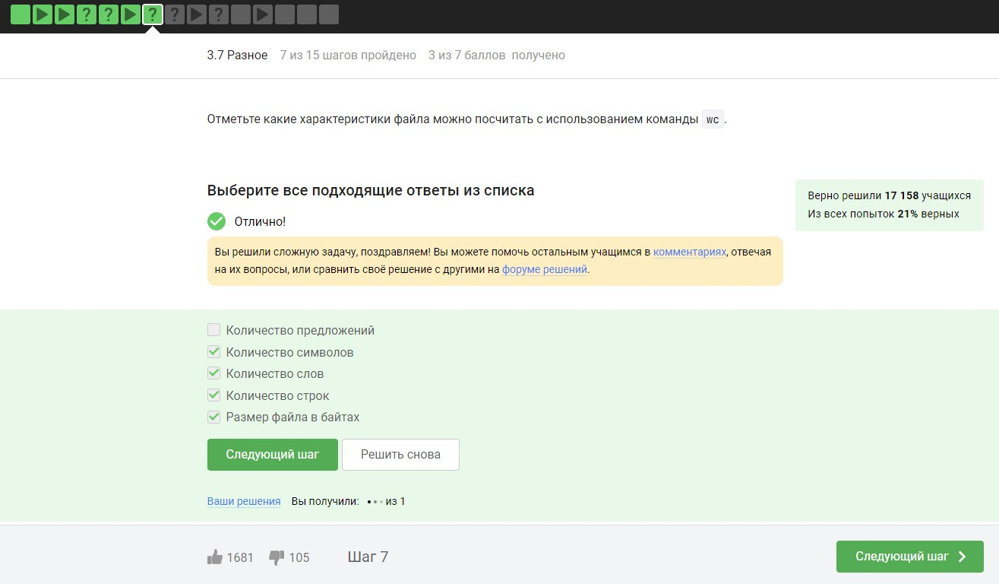{#fig:091 width=70%}

- `-s` (или `--summarize`) означает вывод суммарного размера директории, а не всех поддиректорий и файлов внутри неё.
- `-h` (или `--human-readable`) означает вывод в удобном для чтения формате, в человекочитаемых единицах, таких как Кб, Мб, Гб.

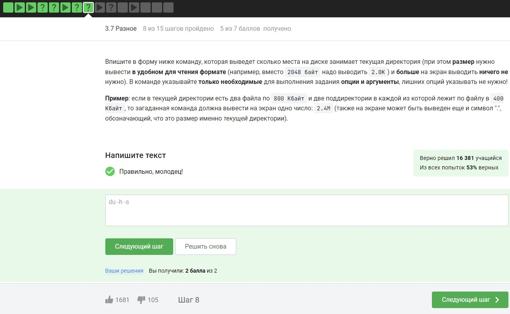{#fig:092 width=70%}

Команда `mkdir dir{1..3}` создаст в текущей директории три поддиректории с именами dir1, dir2 и dir3, используя возможность генерации имен поддиректорий с помощью фигурных скобок и диапазона чисел.

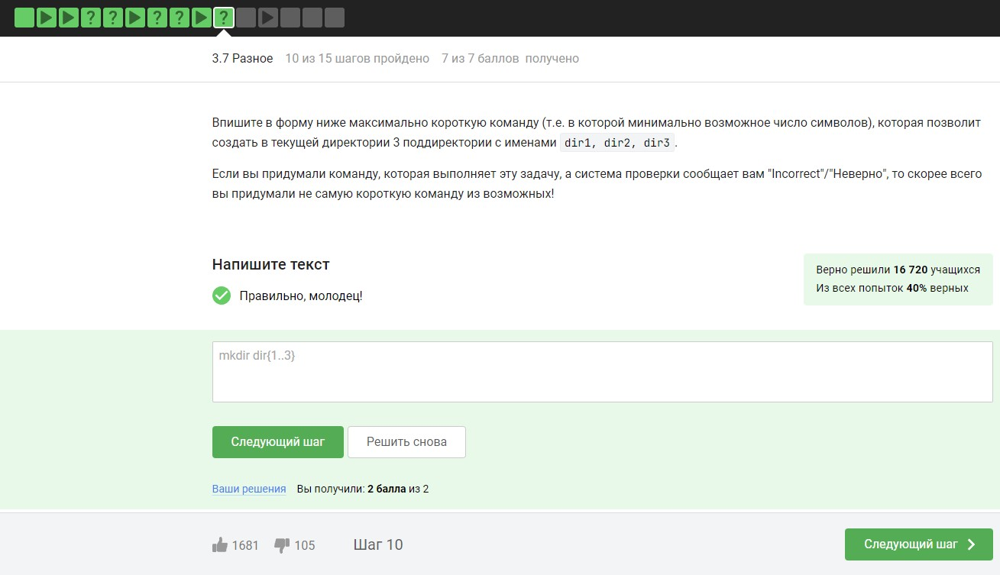{#fig:093 width=70%}


# Выводы

Я усвоил материал и готов дальше изучать Linux.
